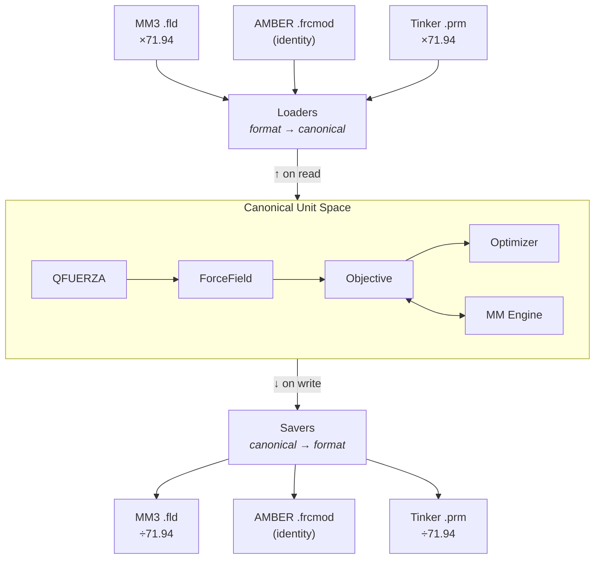
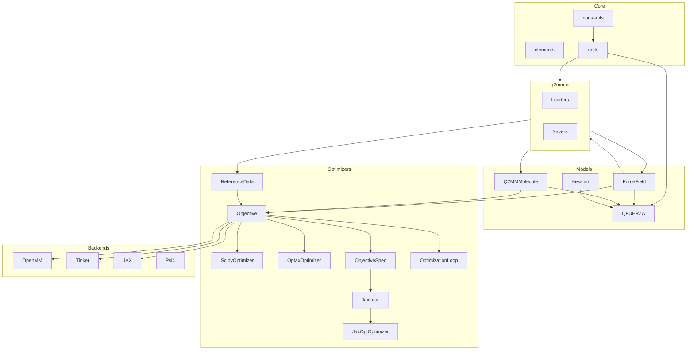

# Architecture

This page describes Q2MM's internal architecture — the module layout,
data model design, and invariants that hold across all backends and
formats.

---

## Design principles

### 1. Format-agnostic data models

All scientific algorithms operate on **format-neutral data structures**:

| Structure | Purpose |
|-----------|---------|
| `ForceField` | Bond, angle, torsion, and vdW parameters with metadata |
| `Q2MMMolecule` | Cartesian geometry, topology, and optional Hessian |
| `ReferenceData` | QM reference values (energies, frequencies, geometries) |

These models have no knowledge of MM3, AMBER, CHARMM, or any file format.
Parsers and savers translate between external formats and internal models at
the boundary.

### 2. Canonical internal units

To decouple the optimizer from any particular force field convention, Q2MM
uses a **canonical unit system** internally:

| Quantity | Canonical Unit | Convention |
|----------|----------------|------------|
| Bond force constant | kcal/(mol·Å²) | E = k(r − r₀)² (no ½ factor) |
| Angle force constant | kcal/(mol·rad²) | E = k(θ − θ₀)² (no ½ factor) |
| Torsion barrier | kcal/mol | Standard Fourier form |
| vdW epsilon | kcal/mol | — |
| Bond equilibrium | Å | — |
| Angle equilibrium | degrees | — |
| vdW radius | Å | — |

This is an AMBER-like convention and the most common in computational
chemistry. The key insight is that the **optimization pipeline** — step sizes,
bounds, convergence criteria, and objective function weights — is calibrated
once in canonical units and works for any force field.

**Conversion happens at the boundary:**



Each loader (e.g., `load_mm3_fld`) multiplies by the appropriate conversion
factor on read; each saver divides on write. The optimizer never sees
format-specific values.

#### Unit type system: NewType vs Pint

The conversion functions in `q2mm/models/units.py` use Python's
[`NewType`](https://docs.python.org/3/library/typing.html#newtype) to give
every unit quantity a distinct static type (`KcalPerMolAngSq`,
`KJPerMolNmSq`, etc.).  At runtime these are plain `float` values — zero
overhead.  Static type checkers (mypy, pyright) catch mismatched conversions
at development time.

[Pint](https://pint.readthedocs.io/) was evaluated as an alternative because it
provides **runtime** dimensional analysis that catches unit mismatches in
`numpy` arrays (which `NewType` cannot cover, since `NewType` wraps scalar
`float` only).  A real double-conversion bug in the Jaguar Hessian parser was
found during that evaluation that `NewType` did not catch — the parser was
incorrectly applying a unit conversion before returning a `numpy.ndarray`,
and downstream code applied the same conversion again, inflating every force
constant by ~9,376×.  That bug was fixed independently; see the
[published FF validation](../benchmarks/published-ff-validation.md) work.

The performance evaluation found Pint's overhead to be unacceptable for
Q2MM's hot loops:

| Approach | µs / call | vs bare multiply |
|----------|----------:|:----------------:|
| Bare multiply (`k * 418.4`) | 0.05 | 1× |
| Pint full parse (`ureg.Quantity(k, 'kcal/mol/Ų').to('kJ/mol/nm²')`) | ~111 | **~2,400×** |
| Pint prebuilt units (reuse parsed unit objects) | ~10 | **~220×** |
| Pint factor-only (precompute once, then bare multiply) | 0.04 | 1× |

The 220–2,400× overhead far exceeds the 5× acceptance threshold for hot-loop
code.  Additional constraints:

- Pint quantities are **not JAX-traceable** and cannot enter `jax.jit` or
  `jax.grad` contexts.  Conversions must remain at the FF↔engine boundary
  (which is already the case), but wrapping `numpy.ndarray` Hessians with
  Pint `Quantity` objects would add friction at that boundary.
- Q2MM's conversion functions are called millions of times during a single
  Nelder-Mead optimization run across all parameters and molecules.

**Revised position: two-tier approach.**

The 5× threshold was designed for hot loops — millions of scalar calls per
optimization.  Parser/loader boundary code runs *once per file load*.  A
220× overhead on a 0.05 µs operation called once is ~11 µs — immeasurable.

The Jaguar double-conversion bug was exactly the class of silent error that
Pint at parser boundaries catches: if the parser had tagged its return value
as `kJ/(mol·Å²)` and the caller had requested `.to('hartree/bohr**2')`,
Pint would have raised a `DimensionalityError` (the `/mol` dimension is
incompatible), surfacing the bug instead of silently inflating every force
constant by 9,376×.

**Adopted architecture:**

- **I/O boundary (parsers):** can return `pint.Quantity` when callers
  opt in (e.g. `get_hessian(tag_units=True)`) — forces callers to
  name the target unit; raises `DimensionalityError` on incompatible unit
  systems (e.g. molar `kJ/(mol·Å²)` vs molecular `Hartree/Bohr²`).
  The default (`tag_units=False`) always returns a bare `np.ndarray`.
- **Internal models and hot loops:** bare `np.ndarray` — zero overhead,
  JAX-traceable; `NewType` for static type safety on scalar conversions.

```python
# q2mm/io/jaguar.py  — cold path: tags once per file load (opt-in)
def get_hessian(self, num_atoms: int, *, tag_units: bool = False) -> np.ndarray:
    ...
    if tag_units:
        ureg = _get_pint_ureg()
        if ureg is not None:
            return ureg.Quantity(hessian, "hartree/bohr**2")
    return hessian  # bare ndarray by default

# q2mm/models/molecule.py  — strips pint tag at the model boundary
@classmethod
def from_structure(cls, structure, *, hessian=None, ...) -> Q2MMMolecule:
    if hessian is not None and hasattr(hessian, "magnitude") and hasattr(hessian, "to"):
        # pint.Quantity: convert to canonical AU and extract magnitude
        hessian = np.asarray(hessian.to("hartree/bohr**2").magnitude)
    ...
```

If a future parser accidentally returns `kJ/(mol·Å²)` data tagged as
`hartree/bohr**2`, the `.to("hartree/bohr**2")` call is a silent no-op —
but the magnitude will be wrong, and the QFUERZA force constants will be
obviously inflated.  If the data is tagged correctly as `kJ/(mol·Å²)`, the
`.to("hartree/bohr**2")` call raises `DimensionalityError` immediately,
surfacing the bug before it can silently corrupt any results.

See `scripts/bench_pint.py` for the microbenchmark.

### 3. Pluggable backends

MM engines implement the `MMEngine` abstract base class:

```python
class MMEngine(ABC):
    @abstractmethod
    def energy(self, structure, forcefield) -> float: ...

    @abstractmethod
    def minimize(self, structure, forcefield) -> tuple: ...

    @abstractmethod
    def hessian(self, structure, forcefield) -> np.ndarray: ...

    @abstractmethod
    def frequencies(self, structure, forcefield) -> list[float]: ...

    def supported_functional_forms(self) -> set[str]: ...
```

Each engine handles its own unit conversions between canonical and whatever
the underlying library expects (e.g., OpenMM uses kJ/mol internally, Tinker
uses kcal/mol).

---

## Module organization

```
q2mm/
├── constants.py          # Physical constants
├── elements.py           # Periodic table data
├── geometry.py           # Geometry helpers (distances, angles, alignment)
├── benchmark_runner.py   # Canonical convergence benchmark runner (backs q2mm.benchmark)
│
├── models/               # Format-neutral data structures
│   ├── forcefield.py     # ForceField, BondParam, AngleParam, TorsionParam, FunctionalForm
│   ├── molecule.py       # Q2MMMolecule, DetectedBond, DetectedTorsion
│   ├── structure.py      # Legacy Structure/Atom/Bond DTO emitted by the parsers
│   ├── loaders.py        # Molecule + force-field convenience loaders
│   ├── datum.py          # Datum data container
│   ├── seminario.py      # Hessian → initial force constants (QFUERZA)
│   ├── hessian.py        # Hessian manipulation, eigenvalue analysis
│   ├── units.py          # Conversion constants and helpers
│   └── identifiers.py    # Atom type matching utilities
│
├── backends/             # MM and QM engine integrations
│   ├── base.py           # MMEngine and QMEngine ABCs
│   ├── registry.py       # Decorator + lazy-discovery backend registry
│   ├── mm/
│   │   ├── openmm.py        # OpenMM engine (harmonic + MM3 dual-mode)
│   │   ├── tinker.py        # Tinker engine (subprocess-based)
│   │   ├── jax_engine.py    # JAX engine (differentiable, analytical gradients)
│   │   ├── jax_md_engine.py # JAX-MD engine (periodic, neighbor lists)
│   │   ├── batched.py       # Batched multi-molecule energy helpers
│   │   └── _jax_common.py   # Shared JAX match/assignment helpers
│   └── qm/
│       └── psi4.py       # Psi4 engine (QM single-points, Hessians)
│
├── optimizers/           # Parameter fitting machinery
│   ├── objective.py      # ObjectiveFunction, ReferenceData
│   ├── protocols.py      # Shared _Optimizer structural protocol
│   ├── scipy_opt.py      # ScipyOptimizer (L-BFGS-B, Nelder-Mead, etc.)
│   ├── optax.py          # OptaxOptimizer (Adam, AdaGrad, SGD — JAX only)
│   ├── jaxopt_opt.py     # JaxOptOptimizer (L-BFGS, L-BFGS-B — end-to-end differentiable)
│   ├── basinhopping.py   # BasinHoppingOptimizer (stochastic global search)
│   ├── multistart.py     # MultiStartOptimizer (best-of-N perturbed starts)
│   ├── jax_multistart.py # JaxMultiStartOptimizer (JAX multi-start)
│   ├── jaxloss.py        # JaxLoss — JIT-compiled loss for JaxOpt/Optax
│   ├── spec.py           # ObjectiveSpec — frozen JAX-compatible objective description
│   ├── cycling.py        # grad-simp parameter cycling (OptimizationLoop)
│   ├── defaults.py       # Default step sizes and bounds
│   └── evaluators/       # Per-category residual evaluators
│       ├── energy.py          # Relative energy residuals
│       ├── frequency.py       # Vibrational frequency residuals
│       ├── geometry.py        # Bond / angle / torsion geometry residuals
│       ├── hessian_element.py # Hessian-element residuals
│       └── eigenmatrix.py     # Eigenmatrix (diagonal / off-diagonal) residuals
│
├── io/                   # File format I/O
│   ├── __init__.py       # Re-exports public functions
│   ├── _helpers.py       # Shared utilities
│   ├── mm3.py            # load_mm3_fld, save_mm3_fld
│   ├── tinker.py         # load_tinker_prm, save_tinker_prm
│   ├── amber.py          # load_amber_frcmod, save_amber_frcmod
│   ├── openmm.py         # save_openmm_xml
│   ├── gaussian.py       # GaussLog
│   ├── fchk.py           # parse_fchk
│   ├── jaguar.py         # JaguarIn, JaguarOut
│   ├── macromodel.py     # MacroModel, MacroModelLog
│   ├── mol2.py           # Mol2
│   ├── cmap.py           # parse_cmap_section, load_cmap_from_prm
│   └── reference.py      # load_reference_yaml, save_reference_yaml
│
├── workflows/            # Multi-stage parameterization protocols
│   ├── base.py           # Workflow Protocol, WorkflowResult, StageResult
│   ├── single_stage.py   # SingleStageWorkflow
│   └── method_e2.py      # MethodE2Workflow (two-stage)
│
└── diagnostics/          # Benchmark systems, analysis, and reporting
    ├── systems.py        # Benchmark system registry (SYSTEMS, SystemData, load_system)
    ├── cli.py            # q2mm-benchmark console entry point
    ├── benchmark.py      # Multi-backend leaderboard benchmarks (run_combo)
    ├── pes_distortion.py # PES distortion analysis
    ├── report.py         # Summary report generation
    └── tables.py         # Formatted table output
```

### Dependency flow



---

## Differentiability status

Q2MM's long-term goal is end-to-end analytical optimization: every
reference-to-loss contribution expressed as a pure, JIT-compiled JAX
computation so that `jax.value_and_grad` gives exact parameter gradients
within one JIT-compiled XLA program/call, avoiding Python↔JAX
round-trips. The table below records what is delivered today versus
what is still tracked.

### Reference kinds

Columns:

- **Python path** — does `ObjectiveFunction` already score this kind via
  its Python evaluators?
- **Analytical ∂L/∂p** — is the residual differentiable through the
  category's per-category evaluator on the Python path? This assumes a
  backend that provides the required analytical Jacobians/Hessian-gradient
  support (for example JAX); otherwise the Python path falls back to
  finite-difference gradients.
- **In JIT loss** — does `jaxloss.JaxLoss` score this kind inside the
  JIT-compiled graph (auto-diff through `value_and_grad`)?

| Reference kind     | Python path | Analytical ∂L/∂p | In JIT loss | Notes |
| ------------------ | :---------: | :--------------: | :---------: | ----- |
| `energy`           | ✅ | ✅ | ✅ | `energy_fn(params, coords)` directly. |
| `frequency`        | ✅ | ✅ | ✅ | `_jax_frequencies_from_hessian` + autodiff through `eigh`. |
| `hessian_element`  | ✅ | ✅ | ✅ | Packed `row * 3N + col` index into `jax.hessian` output. |
| `eig_diagonal`     | ✅ | ✅ | ✅ | Diagonal of `Vᵀ H V` in QM eigenbasis. |
| `eig_offdiagonal`  | ✅ | ✅ | ✅ | Off-diagonal of `Vᵀ H V`; same packed index. |
| `bond_length`      | ✅ | ❌ | ❌ | End-to-end `∂L/∂p` requires differentiable inner minimization (implicit differentiation). Not yet in JIT loss. |
| `bond_angle`       | ✅ | ❌ | ❌ | Same as `bond_length`. |
| `torsion_angle`    | ✅ | ❌ | ❌ | Same as `bond_length`. |

### Optimizers

Columns:

- **Uses JIT loss** — pulls gradients from `JaxLoss` rather than the
  Python-side evaluators.
- **Full XLA loop** — the entire optimizer iteration lives inside
  `jax.jit` (no Python ↔ XLA round-trips per step).
- **Multi-start in XLA** — N-start search fused into one kernel via
  `jax.vmap` (vs. Python `for`-loop orchestration).

| Optimizer                  | Uses JIT loss | Full XLA loop | Multi-start in XLA |
| -------------------------- | :-----------: | :-----------: | :----------------: |
| `ScipyOptimizer`           | ❌ | ❌ | ❌ |
| `OptimizationLoop` (cycling) | ✅ when configured [^cycling-jit] | ❌ | ❌ |
| `OptaxOptimizer`           | ✅ | ❌ (Python step loop) | ❌ |
| `JaxOptOptimizer` (`lbfgs`, `lbfgsb` [^lbfgsb-cpu], `gradient_descent`) | ✅ | ✅ | ❌ |

[^cycling-jit]: `OptimizationLoop` uses `JaxLoss` only when its
    full-space phase is configured with `full_method="jaxopt:*"` or
    `full_method="optax:*"`; otherwise it uses the Python-side evaluators.

[^lbfgsb-cpu]: `jaxopt:lbfgsb` raises `RuntimeError` on non-CPU backends —
    the upstream jaxopt LBFGSB kernel uses XLA argsort/scatter primitives
    that dtype-mismatch on GPU. Use `lbfgs` on GPU.

### Performance levers

| Lever                                   | Status |
| --------------------------------------- | :----: |
| `vmap` over molecules in `JaxLoss._loss_fn` | ✅ Done (topology-grouped) |
| Multi-start as one XLA kernel (`vmap` over init params) | Not started |
| Basin-hopping as a `lax.while_loop` primitive | Not started |
| TS curvature inversion (QFUERZA) inside JIT | ✅ Done |
| Parameter constraints (equivalences, type limits) as JAX projections | Enforced in `ForceField`, not in the JIT graph |

---

## Design invariants

1. **Canonical units everywhere inside the pipeline.** No format-specific unit
   ever reaches the optimizer. Loaders convert on input; savers convert on
   output; engines convert at their own boundary.

2. **Immutable topology.** `Q2MMMolecule` topology (bonds, angles) is fixed at
   construction. Only `ForceField` parameter *values* change during
   optimization.

3. **Stateless engines.** `energy()` and `frequencies()` are pure functions of
   (molecule, forcefield). Engines may cache OpenMM `Context` objects for
   performance, but the cache is invalidated when topology changes.

4. **Functional form consistency.** A `ForceField` carries its `functional_form`
   from load to save. Engines and savers validate compatibility — you cannot
   accidentally evaluate an MM3 force field with a harmonic engine.
