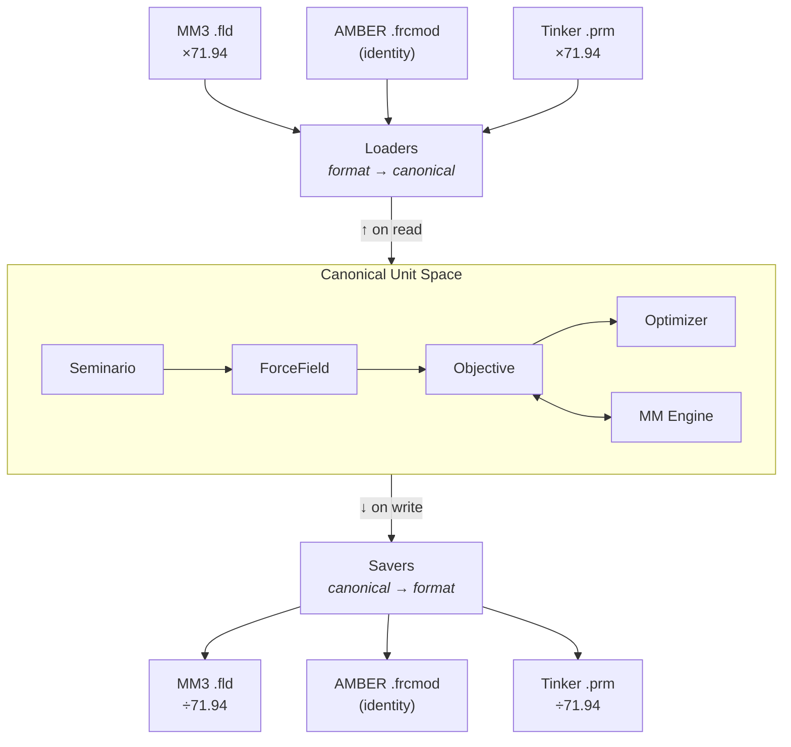
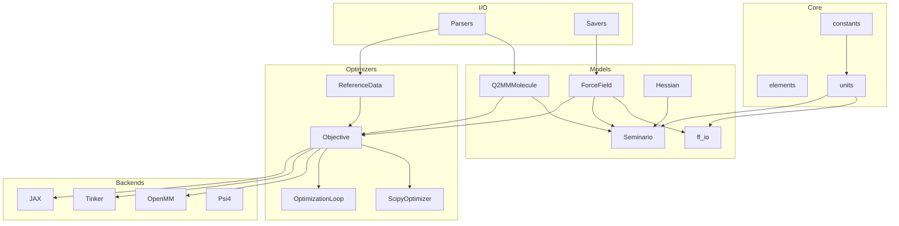

# Architecture

This page describes Q2MM's internal architecture — the module layout,
data model design, and invariants that hold across all backends and
formats.

---

## Design principles

### 1. Format-agnostic data models

All scientific algorithms operate on **format-neutral data structures**:

| Structure | Purpose |
|-----------|---------|
| `ForceField` | Bond, angle, torsion, and vdW parameters with metadata |
| `Q2MMMolecule` | Cartesian geometry, topology, and optional Hessian |
| `ReferenceData` | QM reference values (energies, frequencies, geometries) |

These models have no knowledge of MM3, AMBER, CHARMM, or any file format.
Parsers and savers translate between external formats and internal models at
the boundary.

### 2. Canonical internal units

To decouple the optimizer from any particular force field convention, Q2MM
uses a **canonical unit system** internally:

| Quantity | Canonical Unit | Convention |
|----------|----------------|------------|
| Bond force constant | kcal/(mol·Å²) | E = k(r − r₀)² (no ½ factor) |
| Angle force constant | kcal/(mol·rad²) | E = k(θ − θ₀)² (no ½ factor) |
| Torsion barrier | kcal/mol | Standard Fourier form |
| vdW epsilon | kcal/mol | — |
| Bond equilibrium | Å | — |
| Angle equilibrium | degrees | — |
| vdW radius | Å | — |

This is an AMBER-like convention and the most common in computational
chemistry. The key insight is that the **optimization pipeline** — step sizes,
bounds, convergence criteria, and objective function weights — is calibrated
once in canonical units and works for any force field.

**Conversion happens at the boundary:**



Each loader (e.g., `load_mm3_fld`) multiplies by the appropriate conversion
factor on read; each saver divides on write. The optimizer never sees
format-specific values.

### 3. Pluggable backends

MM engines implement the `MMEngine` abstract base class:

```python
class MMEngine(ABC):
    @abstractmethod
    def energy(self, structure, forcefield) -> float: ...

    @abstractmethod
    def minimize(self, structure, forcefield) -> tuple: ...

    @abstractmethod
    def hessian(self, structure, forcefield) -> np.ndarray: ...

    @abstractmethod
    def frequencies(self, structure, forcefield) -> list[float]: ...

    def supported_functional_forms(self) -> set[str]: ...
```

Each engine handles its own unit conversions between canonical and whatever
the underlying library expects (e.g., OpenMM uses kJ/mol internally, Tinker
uses kcal/mol).

---

## Module organization

```
q2mm/
├── models/               # Format-neutral data structures
│   ├── forcefield.py     # ForceField, BondParam, AngleParam, TorsionParam, FunctionalForm
│   ├── molecule.py       # Q2MMMolecule, DetectedBond, DetectedTorsion
│   ├── ff_io.py          # Loaders/savers (MM3, AMBER, Tinker, OpenMM XML)
│   ├── seminario.py      # Hessian → initial force constants
│   ├── hessian.py        # Hessian manipulation, eigenvalue analysis
│   ├── units.py          # Conversion constants and helpers
│   └── identifiers.py    # Atom type matching utilities
│
├── backends/             # MM and QM engine integrations
│   ├── base.py           # MMEngine and QMEngine ABCs
│   ├── mm/
│   │   ├── openmm.py     # OpenMM engine (harmonic + MM3 dual-mode)
│   │   ├── tinker.py        # Tinker engine (subprocess-based)
│   │   ├── jax_engine.py   # JAX engine (differentiable, analytical gradients)
│   │   └── jax_md_engine.py # JAX-MD engine (periodic, neighbor lists)
│   └── qm/
│       └── psi4.py       # Psi4 engine (QM single-points, Hessians)
│
├── optimizers/           # Parameter fitting machinery
│   ├── objective.py      # ObjectiveFunction, ReferenceData
│   ├── scipy_opt.py      # ScipyOptimizer (L-BFGS-B, Nelder-Mead, etc.)
│   ├── cycling.py        # grad-simp parameter cycling
│   ├── scoring.py        # Legacy scoring functions
│   └── defaults.py       # Default step sizes and bounds
│
├── parsers/              # File format I/O
│   ├── gaussian.py       # Gaussian log/fchk parsing
│   ├── jaguar.py         # Jaguar input/output parsing
│   ├── macromodel.py     # MacroModel log parsing
│   ├── mm3.py            # MM3 .fld file parsing
│   ├── tinker_ff.py      # Tinker parameter file parsing
│   ├── amber_ff.py       # AMBER frcmod parsing
│   ├── mol2.py           # MOL2 structure parsing
│   └── ...               # Supporting utilities
│
├── diagnostics/          # Analysis and reporting
│   ├── benchmark.py      # Timing and accuracy benchmarks
│   ├── pes_distortion.py # PES distortion analysis
│   ├── report.py         # Summary report generation
│   └── tables.py         # Formatted table output
│
├── constants.py          # Physical constants
└── elements.py           # Periodic table data
```

### Dependency flow



---

## Design invariants

1. **Canonical units everywhere inside the pipeline.** No format-specific unit
   ever reaches the optimizer. Loaders convert on input; savers convert on
   output; engines convert at their own boundary.

2. **Immutable topology.** `Q2MMMolecule` topology (bonds, angles) is fixed at
   construction. Only `ForceField` parameter *values* change during
   optimization.

3. **Stateless engines.** `energy()` and `frequencies()` are pure functions of
   (molecule, forcefield). Engines may cache OpenMM `Context` objects for
   performance, but the cache is invalidated when topology changes.

4. **Functional form consistency.** A `ForceField` carries its `functional_form`
   from load to save. Engines and savers validate compatibility — you cannot
   accidentally evaluate an MM3 force field with a harmonic engine.
