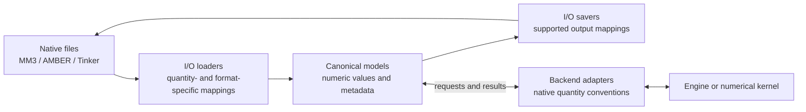
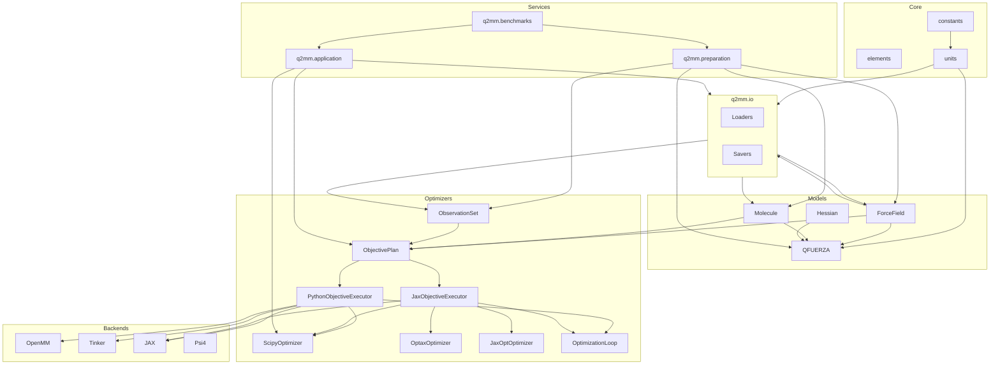

# Architecture

Q2MM fits force-field parameters to quantum-mechanical reference data.
This page explains which components own the scientific data, unit
conversions, and execution contracts, so they can be composed without
confusing a shared representation with identical physical behavior.

---

## Design principles

### 1. Format-agnostic data models

Fitting code operates on **format-neutral data structures**:

| Structure | Purpose |
|-----------|---------|
| `ForceField` | Immutable parameters, functional-form identity, and source metadata |
| `Molecule` | Immutable atomic symbols, geometry, topology, and optional Hessian |
| `ObservationSet` | Immutable typed reference observations and their training-case bindings |

The models can record a functional form or source identifier without owning
a native file parser or computational engine. Parsers and savers translate
external representations; backend adapters implement the requested
calculations. The optimizer consumes the resulting numerical contracts,
not native parameter-file records.

### 2. Canonical internal units

A canonical unit specifies how to interpret a stored number. Q2MM uses
the following **canonical units** for force-field parameters:

| Quantity | Canonical Unit | Convention |
|----------|----------------|------------|
| Bond force constant | kcal/(mol·Å²) | E = k(r − r₀)² (no ½ factor) |
| Angle force constant | kcal/(mol·rad²) | E = k(θ − θ₀)² (no ½ factor) |
| Torsion barrier | kcal/mol | Standard Fourier form |
| vdW epsilon | kcal/mol | — |
| Bond equilibrium | Å | — |
| Angle equilibrium | degrees | — |
| vdW radius | Å | — |

The harmonic expressions state a coefficient convention, not the complete
energy function for every functional form. Other quantities, such as
Hessians, have their own canonical representations. The
[conversion helpers](https://github.com/ericchansen/q2mm/blob/0ebdece9b4042ccc41ea8650484722232ce5c871/q2mm/models/units.py)
define mappings for particular quantities and conventions.

Canonical units make data exchange consistent; they do not supply a
universal choice of parameter bounds, step sizes, observation weights, or
stopping criteria. Those remain explicit parts of the problem, backend,
and optimizer configuration.

**Conversion happens at the boundary:**



There is no single conversion factor for an entire `.fld`, `.prm`, or
`.frcmod` file. For example, the MM3 bond, angle, and stretch-bend helpers
use distinct mappings. OpenMM conversions also distinguish a custom force
using `E = k(x - x0)^2` from a harmonic force using `E = 0.5 k(x - x0)^2`;
matching unit labels alone cannot identify that coefficient convention.
Lengths, angles, torsion coefficients, and Hessians require their own
appropriate mappings. Some values already have canonical units, but that
does not make a whole file or physical model an identity conversion.

#### Unit type system: NewType vs Pint

Scalar conversion signatures use Python's
[`NewType`](https://docs.python.org/3/library/typing.html#newtype) labels,
such as `KcalPerMolAngSq` and `KJPerMolNmSq`, to distinguish units where
those annotations are used. Runtime values remain numbers. These labels
are not runtime dimensional checks and do not provide complete unit safety
for bare floats or arrays.

[Pint](https://pint.readthedocs.io/en/stable/getting/tutorial.html) provides
optional runtime unit tags at supported input boundaries.
[`JaguarIn.get_hessian`](https://github.com/ericchansen/q2mm/blob/0ebdece9b4042ccc41ea8650484722232ce5c871/q2mm/io/jaguar.py)
returns a bare NumPy array by default. With `tag_units=True` and Pint
available, it returns a quantity tagged as `hartree/bohr**2`; Pint and its
unit registry are loaded lazily. If Pint is absent, the current method
still returns the bare array, even when tagging was requested.

[`Molecule.with_hessian`](https://github.com/ericchansen/q2mm/blob/0ebdece9b4042ccc41ea8650484722232ce5c871/q2mm/models/molecule.py)
treats bare arrays as already in canonical atomic units. Its
[Hessian normalization helper](https://github.com/ericchansen/q2mm/blob/0ebdece9b4042ccc41ea8650484722232ce5c871/q2mm/models/hessian.py)
converts unit-tagged inputs through `.to(...)` and extracts their numeric
magnitude. Incompatible conversions propagate an error. Bare arrays in
other supported units must be normalized explicitly with
`hessian_to_atomic_units`; units cannot be inferred from the numbers alone.

Internal model arrays stay numeric. The
[JAX backend array boundary](https://github.com/ericchansen/q2mm/blob/0ebdece9b4042ccc41ea8650484722232ce5c871/q2mm/backends/mm/_jax_common.py)
constructs JAX arrays for traced calculations rather than passing Pint
quantities into those kernels. This describes the current data path, not
a blanket claim about every library's JAX interoperability.

Unit checks rely on truthful labels: neither a static unit type nor a
runtime quantity can prove that the declared units match the supplied
magnitudes or that two physical models are equivalent. Format-specific
tests and scientific validation remain necessary. The
[optional microbenchmark script](https://github.com/ericchansen/q2mm/blob/0ebdece9b4042ccc41ea8650484722232ce5c871/scripts/bench_pint.py)
describes measurement workloads; its expected-output example is not a
portable timing guarantee. This architecture does not depend on a fixed
speed ratio.

### 3. Pluggable backends

MM backends implement the typed prepared-session contract in
`q2mm.backends.contracts`: a concrete backend exposes `info` and `prepare`,
then the prepared session answers explicit request types for energies,
minimization, Hessians, frequencies, and parameter derivatives.

```python
from q2mm.backends.contracts import EnergyRequest, PreparationRequest
from q2mm.backends.mm.openmm import OpenMMBackend
from q2mm.models.parameters import ParameterLayout

backend = OpenMMBackend()
layout = ParameterLayout.from_force_field(forcefield)
full_vector = layout.vector(forcefield)

prepared = backend.prepare(
    PreparationRequest(case_id="example", molecule=molecule, force_field=forcefield)
)
energy = prepared.energy(EnergyRequest(parameters=full_vector)).energy
```

Backend adapters own the conversions required by their native quantity
conventions. Shared canonical units do **not** establish backend physical
equivalence: implemented terms, interaction rules, coefficient conventions,
and numerical controls must be checked separately before claiming
equivalent calculations.

Nor is there a universal minimizer tolerance. The
[`MinimizationRequest` contract](https://github.com/ericchansen/q2mm/blob/0ebdece9b4042ccc41ea8650484722232ce5c871/q2mm/backends/contracts.py#L499-L518)
defines tolerance in the backend's native units, with `None` selecting its
native default. The same numeric value must not be assumed to select the
same stopping criterion across engines. Correct units and finite returned
coordinates alone do not establish convergence validity.

Both built-in backends and out-of-tree plugins are declared as JSON-safe
*manifest* mappings and validated by a single path
(`q2mm.backends.discovery.validate_manifest`). `q2mm.backends.registry`
discovers them **lazily**: importing it enumerates nothing, cataloging runs only
cheap dependency probes, and a backend implementation is imported solely on an
explicit `load_backend`. Out-of-tree plugins advertise one entry point in the
`q2mm.backends` group targeting a lightweight descriptor module; a missing
dependency, import error, incompatible API version, duplicate name, invalid
claim, or broken factory is isolated into a typed discovery record and never
hides a healthy backend.

This is the stable public `BACKEND_API_VERSION == 1` authoring boundary.
Manifests use exactly `backend_api_version`, `name`, `role`,
`capability_ceiling`, `functional_form_ceiling`, `factory`, and optional
`probe`. Static ceilings describe possible support; loaded `BackendInfo`
declares authoritative runtime subsets, with exact role equality and no
overclaims. Pre-v1 names have no aliases. See
[Authoring a backend plugin](../backends/authoring.md) for validation,
conflict-priority, conformance, and packaging details.

---

## Benchmark ownership

The benchmark runner coordinates a candidate's lifecycle; it does not own
every operation needed by a run. `run_profile` and `run_profiles` remain the
single execution/promotion path, including status classification and the
decision to publish accepted candidates.

| Owner | Responsibility and reused boundary |
|-------|------------------------------------|
| `benchmarks.profiles` | Requested/resolved identities and configuration adapters; optimizer construction uses `optimizers.catalog`, and external roots use `benchmarks.systems._paths` |
| `benchmarks.acceptance` | Existing acceptance policy and executor-ratio classification |
| `benchmarks.analysis` | Frequency, PES-distortion, and configured-executor sample diagnostics; objective metric formulas remain in `objectives.metrics` |
| `benchmarks.records` | Candidate/outcome envelopes and provenance; full results and stage-only summaries use `_result_serialization`, and scientific digests use the application model's single-payload fingerprint helper |
| `benchmarks.artifacts` | JSON files and accepted-artifact mechanics; validated staging, public output-role checks, reservations, and temporary/cleanup helpers come from `application.persistence` |
| `benchmarks.runner` | Resolution/execution order, score-of-record evaluation, acceptance and publication gates, incremental persistence and promotion decisions |

Historical public imports from `benchmarks.runner` are direct re-exports of
their owners. There is no second runner or result-projection field list.
Analysis, records, artifacts, and profile helpers do not import the runner,
and importing these modules does not load optional computational runtimes.

Benchmark promotion retains its copy-snapshot transaction contract, distinct
from the SDK's rename-based installation. Both reuse the same public
output-role validation and exclusive filesystem reservations. Promotion
preflights final paths before allocating a record or staging files, then
holds reservations through snapshots, installation, rollback, and cleanup.
It does not overwrite manifest-owned force fields or introduce a recovery
policy. This split changes ownership, not either transaction or the
execution/acceptance policy.

Configured-executor endpoint means, intervals, counts, and raw samples stay
separate from the independently evaluated Python objective of record. For
multi-stage results, cross-stage sample comparisons and the final executor
ratio remain explicitly omitted; publication audits receive no ratio and
fail closed rather than comparing different objective plans.

## Module organization

```
q2mm/
├── constants.py          # Physical constants
├── elements.py           # Periodic table data
├── geometry.py           # Geometry helpers (distances, angles, alignment)
├── resources.py          # Installed scientific-resource lookup and integrity checks
├── preparation.py        # Generic immutable prepare() + closed observation recipes
├── _result_serialization.py # Canonical full-result and stage-only projections
├── _jax_support.py       # Foundational lazy JAX import guard (has_jax/load_jax); shared by models.hessian and backends.mm._jax_common
├── data/sn2/             # Approved CH3F/SN2 package resource + provenance manifest
├── application/          # Data-independent evaluate, optimize, and atomic save services
│   ├── models.py        # Immutable resolved configuration + OptimizationRun/SavedOutput
│   ├── configuration.py # Exact built-in capture + optional ConfigurationProvider protocol
│   ├── evaluation.py    # Typed OptimizationProblem and reference-property evaluation
│   ├── optimization.py  # Strict recipe/component resolution and generic execution
│   └── persistence.py   # Semantic FF formats + deterministic run manifests
│
├── benchmarks/           # Benchmark systems, explicit profiles, acceptance, and publication persistence
│   ├── cases.py         # BenchmarkCase wrapper around OptimizationProblem
│   ├── publications.py  # Canonical source-completeness records and blocked rows
│   ├── profiles.py      # Profile identities + configuration/data-root adapters over existing resolvers
│   ├── acceptance.py    # Candidate status, no-progress/worsening policy, and executor-ratio classification
│   ├── analysis.py      # Frequency, PES-distortion, and optimizer-sample diagnostics
│   ├── records.py       # Immutable candidate/outcome envelopes + canonical projection/provenance adapters
│   ├── artifacts.py     # Strict JSON storage + accepted-artifact staging, snapshots, rollback, cleanup
│   ├── runner.py        # The one execution/promotion coordinator (run_profile/run_profiles)
│   ├── cli.py           # q2mm-benchmark console entry point (list/preflight/single/batch/matrix/load)
│   └── systems/         # load_system(), SYSTEM_KEYS, per-system modules
│       ├── ch3f.py      # CH3F matched-frequency benchmark
│       ├── ch3f_sn2.py  # CH3F SN2 transition-state benchmark
│       ├── ferrocene.py # Wahlers Chapter 4 seven-structure ground-state profile
│       ├── heck_relay.py # Heck-relay publication system
│       ├── pd_allyl.py  # Pd-allyl publication system
│       ├── pd_conjugate.py # Pd conjugate-addition publication system
│       ├── rh_conjugate.py # Rh conjugate-addition publication system
│       └── rh_enamide.py # Rh-enamide publication system
│
├── models/               # Format-neutral data structures
│   ├── forcefield.py     # ForceField, BondParam, AngleParam, TorsionParam, FunctionalForm
│   ├── molecule.py       # Molecule, Bond, Angle, Torsion
│   ├── observations.py   # Geometry/Hessian plus typed publication objective observations
│   ├── parameters.py     # ParameterLayout + ActiveParameterSpace
│   ├── problem.py        # TrainingCase + OptimizationProblem + path-free PreparationProvenance
│   ├── publication.py    # Reproduction statuses, citations, completeness, source identities
│   ├── results.py        # Canonical OptimizationResult, CandidateRecord, StageRecord
│   ├── seminario.py      # Hessian → initial force constants (QFUERZA)
│   ├── hessian.py        # Hessian manipulation, eigenvalue analysis
│   ├── units.py          # Conversion constants and helpers
│   └── identifiers.py    # Atom type matching utilities
│
├── backends/             # MM and reference backend integrations
│   ├── contracts.py      # Capability contracts, prepared-session protocols, typed requests/results, descriptors
│   ├── registry.py       # Public lazy, cached descriptor registry (built-in + entry-point manifests; cheap probes)
│   ├── discovery.py      # API-v1 manifest validator + lazy entry-point discovery/isolation records
│   ├── conformance.py    # Dependency-light public MM/reference backend conformance
│   ├── mm/
│   │   ├── openmm.py        # OpenMM backend (harmonic + MM3 dual-mode)
│   │   ├── _openmm_terms.py # OpenMM internal term records
│   │   ├── _openmm_units.py # OpenMM scalar unit converters
│   │   ├── tinker.py        # Tinker backend (subprocess-based)
│   │   ├── jax_engine.py    # JAX backend (differentiable, analytical gradients)
│   │   ├── jax_md_engine.py # JAX-MD backend (periodic, neighbor lists)
│   │   ├── batched.py       # Batched multi-molecule energy helpers
│   │   └── _jax_common.py   # Backend jax/jnp/jaxopt globals + ForceField match/offset helpers (JAX import guard itself lives in q2mm/_jax_support.py)
│   ├── qm/
│   │   └── psi4.py       # Direct Psi4 reference backend
│   └── reference/
│       ├── qcengine.py   # QCEngine atomic energy, coordinate-gradient, and Hessian adapter
│       └── ase.py        # Optional non-periodic ASE energy and force adapter
│
├── objectives/           # Objective planning, executor protocol, and residual semantics
│   ├── plan.py           # ObjectivePlan: backend-neutral cases, observations, layout, active space
│   ├── protocols.py      # ObjectiveEvaluator protocol, Evaluation, GradientMode, objective errors
│   ├── python.py         # PythonObjectiveExecutor over the prepared-backend contract
│   ├── jax.py            # JaxObjectiveExecutor for differentiable objectives
│   └── metrics.py        # Shared residual, regularization, and category metric helpers
│
├── optimizers/           # Parameter fitting machinery
│   ├── catalog.py        # Explicit presets + canonical constructor/settings graphs
│   ├── protocols.py      # Shared _Optimizer structural protocol
│   ├── scipy_opt.py      # ScipyOptimizer (L-BFGS-B, Nelder-Mead, etc.)
│   ├── optax.py          # OptaxOptimizer (Adam, AdaGrad, SGD — JAX only)
│   ├── jaxopt_opt.py     # JaxOptOptimizer (L-BFGS, L-BFGS-B — end-to-end differentiable)
│   ├── basinhopping.py   # BasinHoppingOptimizer (stochastic global search)
│   ├── multistart.py     # MultiStartOptimizer (best-of-N perturbed starts)
│   ├── jax_multistart.py # JaxMultiStartOptimizer (JaxOpt construction adapter)
│   └── cycling.py        # grad-simp parameter cycling (OptimizationLoop, sensitivity)
│
├── io/                   # File format I/O
│   ├── __init__.py       # Re-exports public functions
│   ├── _helpers.py       # Shared utilities
│   ├── mm3.py            # load_mm3_fld, save_mm3_fld
│   ├── tinker.py         # load_tinker_prm, save_tinker_prm
│   ├── amber.py          # load_amber_frcmod, save_amber_frcmod
│   ├── openmm.py         # save_openmm_xml
│   ├── gaussian.py       # GaussLog
│   ├── fchk.py           # load_fchk, load_fchk_reference
│   ├── jaguar.py         # JaguarIn, JaguarOut
│   ├── macromodel.py     # MacroModel, MacroModelLog
│   ├── molecules.py      # Explicit FCHK/Gaussian/Jaguar/MacroModel Molecule bridges
│   ├── mol2.py           # Mol2
│   ├── xyz.py            # load_xyz
│   ├── qcelemental.py    # molecule_from_qcel, molecule_to_qcel
│   ├── cmap.py           # parse_cmap_section, load_cmap_from_prm
│   └── reference.py      # load_reference_yaml, save_reference_yaml
│
└── workflows/            # Multi-stage parameterization protocols
    ├── base.py           # Workflow Protocol returning OptimizationResult + StageRecord data
    ├── single_stage.py   # SingleStageWorkflow
    └── method_e2.py      # MethodE2Workflow (two-stage)
```

The architecture guards compare full package-relative paths, not just file
names. Moving a module to another layer therefore requires updating this map.
Dependency checks follow absolute and relative imports, including imports
inside functions; retired module paths must stay absent. Historical prose
and unrelated identifiers are not treated as executable dependencies.

`q2mm.application` depends on canonical models, backend contracts, objectives,
optimizers, workflows, and format savers. It never imports benchmark systems or
preparation code. `q2mm.preparation` depends only on canonical models and
dependency-light backend contracts; a matched-frequency recipe loads a named
backend only when `prepare()` is called. Benchmark orchestration delegates
problem construction to preparation and generic execution/serialization to the
application layer, while retaining benchmark-specific metadata, profiles,
acceptance decisions, candidate retention, and promotion.

The package root exposes only the workflow facade and its canonical return
types: `prepare`, `evaluate`, `optimize`, and `save`. Importing `q2mm` does not
load an optional backend, SciPy, JAX, ASE, QCEngine, OpenMM, or backend
discovery. Advanced constructors and contracts remain in their existing
namespaces.

### Release and scientific-data boundary

Q2MM's release artifacts use an explicit data contract:

- Wheels contain Python modules, `py.typed`, distribution metadata, and only
  the generated CH3F/SN2 resource in `q2mm/data/sn2/`.
- Source distributions contain only the inputs needed to build that wheel.
  Tests, examples, documentation, workflows, validation data, and raw
  third-party outputs are repository-only.
- `q2mm.resources.sn2_reference_dir()` resolves the built-in data through
  `importlib.resources`, so source checkouts and installed wheels use the same
  canonical files. `manifest.json` records provenance, license, size, and
  SHA-256 for every scientific payload file.
- Rh-enamide, dissertation supporting information, and the licensed MM3 base
  force field are not distributed. Pass `ExternalDataRoots` to
  `load_system(data_roots=...)`, or configure `Q2MM_RH_ENAMIDE`,
  `Q2MM_SUPPORTING_INFO`, and `Q2MM_MM3_BASE`. Loaders never search above the
  installed package or substitute a tracked force field.

The publish workflow runs `scripts/check_release_artifacts.py` before upload.
It validates both manifests, rebuilds the wheel from the sdist, compares wheel
payloads, installs the rebuilt wheel into a clean environment, and exercises
the lazy facade import, CLI, resource integrity, built-in CH3F system, and a
synthetic prepare/evaluate/optimizer-entry/save workflow.

### Dependency flow



---

## Differentiability status

Q2MM's long-term goal is end-to-end analytical optimization: every
reference-to-loss contribution expressed through an explicit executor whose
gradient mode is declared up front. The production JAX path deliberately
compiles one JIT fragment per training case and aggregates those case losses
in Python. That avoids putting all molecules into one large XLA graph while
still using `jax.value_and_grad` for exact parameter gradients inside each
case. The table below records what is delivered today versus what is still
tracked.

### Reference kinds

Columns:

- **Python executor** — does `PythonObjectiveExecutor` score this kind via
  the typed backend contract?
- **Analytical ∂L/∂p** — is the residual differentiable through the
  Python executor? This assumes a backend that provides the required
  analytical Jacobians/Hessian-gradient support. Unsupported requests raise
  `ObjectiveGradientError`; there is no silent fallback.
- **JAX executor** — does `JaxObjectiveExecutor` score this kind inside its
  per-case JIT fragment (auto-diff through `value_and_grad`)?

| Reference kind     | Python executor | Analytical ∂L/∂p | JAX executor | Notes |
| ------------------ | :---------: | :--------------: | :---------: | ----- |
| `energy`           | ✅ | ✅ | ✅ | `energy_fn(params, coords)` directly. |
| `frequency`        | ✅ | ✅ | ✅ | `_jax_frequencies_from_hessian` + autodiff through `eigh`. |
| `hessian_element`  | ✅ | ✅ | ✅ | Packed `row * 3N + col` index into `jax.hessian` output. |
| `eig_diagonal`     | ✅ | ✅ | ✅ | Diagonal of `Vᵀ H V` in QM eigenbasis. |
| `eig_offdiagonal`  | ✅ | ✅ | ✅ | Off-diagonal of `Vᵀ H V`; same packed index. |
| `bond_length`      | ✅ | ❌ | ✅ | Python analytical gradients are unsupported for geometry categories; use the JAX executor for analytical geometry gradients. |
| `bond_angle`       | ✅ | ❌ | ✅ | Same as `bond_length`. |
| `torsion_angle`    | ✅ | ❌ | ✅ | Same as `bond_length`. |

### Optimizers

Columns:

- **Uses JAX executor** — pulls gradients from `JaxObjectiveExecutor` rather
  than finite differences on the Python executor.
- **Full XLA loop** — the entire optimizer iteration lives inside
  `jax.jit` (no Python ↔ XLA round-trips per step).
- **Multi-start in XLA** — N-start search fused into one kernel via
  `jax.vmap` (vs. Python `for`-loop orchestration).

| Optimizer                  | Uses JAX executor | Full XLA loop | Multi-start in XLA |
| -------------------------- | :-----------: | :-----------: | :----------------: |
| `ScipyOptimizer`           | ✅ when passed a JAX executor | ❌ | ❌ |
| `OptimizationLoop` (cycling) | ✅ when passed a JAX executor [^cycling-jit] | ❌ | ❌ |
| `OptaxOptimizer`           | ✅ | ❌ (Python step loop) | ❌ |
| `JaxOptOptimizer` (`lbfgs`, `lbfgsb` [^lbfgsb-cpu], `gradient_descent`) | ✅ | ❌ (Python step loop) | ❌ |

[^cycling-jit]: `OptimizationLoop` consumes the evaluator you pass in. A
    `JaxObjectiveExecutor` gives the full-space phase analytical per-case JAX
    gradients; a default `PythonObjectiveExecutor` lets SciPy use finite
    differences.

[^lbfgsb-cpu]: `jaxopt:lbfgsb` raises `RuntimeError` on non-CPU backends —
    the upstream jaxopt LBFGSB kernel uses XLA argsort/scatter primitives
    that dtype-mismatch on GPU. Use `lbfgs` on GPU.

### Performance levers

| Lever                                   | Status |
| --------------------------------------- | :----: |
| Per-case JIT fragments with Python aggregation | ✅ Done |
| Multi-start as one XLA kernel (`vmap` over init params) | Not started |
| Basin-hopping as a `lax.while_loop` primitive | Not started |
| TS curvature inversion (QFUERZA) inside JIT | ✅ Done |
| Parameter constraints (equivalences, type limits) as JAX projections | Enforced in `ForceField`, not in the JIT graph |

---

## Design invariants

1. **Explicit unit contracts at boundaries.** Models expose documented
   canonical quantities. I/O and backend adapters own the relevant
   conversions; unit labels do not replace input validation or prove
   physical equivalence.

2. **Immutable scientific models.** `Molecule` topology (bonds, angles) is
   fixed at construction, and `ForceField` rows are frozen dataclass values.
   Optimization changes only explicit parameter vectors/materialized replacements
   via `ParameterLayout` and `ActiveParameterSpace`.

3. **Prepared-session backends.** A backend factory prepares one session per
   training case; typed requests carry full parameter vectors for `energy()`,
   `frequencies()`, and related operations. Backends may cache native state
   such as an OpenMM `Context`, but topology changes require a new prepared
   session.

4. **Functional form compatibility is not complete equivalence.** A
   `ForceField` carries its `functional_form` from load to save. Backend and
   saver compatibility checks do not, by themselves, establish term coverage,
   identical potentials, or matching numerical stopping rules.
