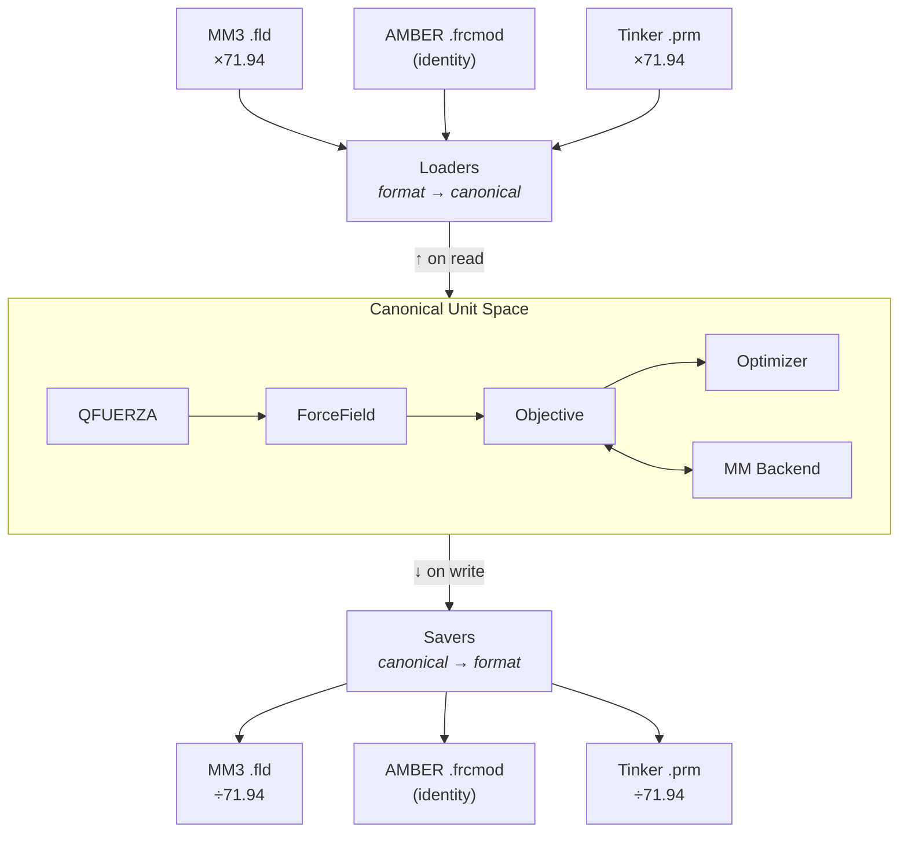
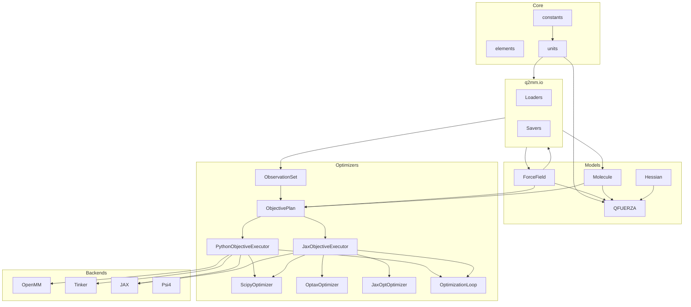

# Architecture

This page describes Q2MM's internal architecture — the module layout,
data model design, and invariants that hold across all backends and
formats.

---

## Design principles

### 1. Format-agnostic data models

All scientific algorithms operate on **format-neutral data structures**:

| Structure | Purpose |
|-----------|---------|
| `ForceField` | Immutable bond, angle, torsion, and vdW parameters with metadata |
| `Molecule` | Cartesian geometry, topology, and optional Hessian |
| `ObservationSet` | QM reference targets (energies, frequencies, geometries, eigenmatrix terms) |

These models have no knowledge of MM3, AMBER, CHARMM, or any file format.
Parsers and savers translate between external formats and internal models at
the boundary.

### 2. Canonical internal units

To decouple the optimizer from any particular force field convention, Q2MM
uses a **canonical unit system** internally:

| Quantity | Canonical Unit | Convention |
|----------|----------------|------------|
| Bond force constant | kcal/(mol·Å²) | E = k(r − r₀)² (no ½ factor) |
| Angle force constant | kcal/(mol·rad²) | E = k(θ − θ₀)² (no ½ factor) |
| Torsion barrier | kcal/mol | Standard Fourier form |
| vdW epsilon | kcal/mol | — |
| Bond equilibrium | Å | — |
| Angle equilibrium | degrees | — |
| vdW radius | Å | — |

This is an AMBER-like convention and the most common in computational
chemistry. The key insight is that the **optimization pipeline** — step sizes,
bounds, convergence criteria, and objective function weights — is calibrated
once in canonical units and works for any force field.

**Conversion happens at the boundary:**



Each loader (e.g., `load_mm3_fld`) multiplies by the appropriate conversion
factor on read; each saver divides on write. The optimizer never sees
format-specific values.

#### Unit type system: NewType vs Pint

The conversion functions in `q2mm/models/units.py` use Python's
[`NewType`](https://docs.python.org/3/library/typing.html#newtype) to give
every unit quantity a distinct static type (`KcalPerMolAngSq`,
`KJPerMolNmSq`, etc.).  At runtime these are plain `float` values — zero
overhead.  Static type checkers (mypy, pyright) catch mismatched conversions
at development time.

[Pint](https://pint.readthedocs.io/) was evaluated as an alternative because it
provides **runtime** dimensional analysis that catches unit mismatches in
`numpy` arrays (which `NewType` cannot cover, since `NewType` wraps scalar
`float` only).  A real double-conversion bug in the Jaguar Hessian parser was
found during that evaluation that `NewType` did not catch — the parser was
incorrectly applying a unit conversion before returning a `numpy.ndarray`,
and downstream code applied the same conversion again, inflating every force
constant by ~9,376×.  That bug was fixed independently; see the
[published FF validation](../benchmarks/published-ff-validation.md) work.

The performance evaluation found Pint's overhead to be unacceptable for
Q2MM's hot loops:

| Approach | µs / call | vs bare multiply |
|----------|----------:|:----------------:|
| Bare multiply (`k * 418.4`) | 0.05 | 1× |
| Pint full parse (`ureg.Quantity(k, 'kcal/mol/Ų').to('kJ/mol/nm²')`) | ~111 | **~2,400×** |
| Pint prebuilt units (reuse parsed unit objects) | ~10 | **~220×** |
| Pint factor-only (precompute once, then bare multiply) | 0.04 | 1× |

The 220–2,400× overhead far exceeds the 5× acceptance threshold for hot-loop
code.  Additional constraints:

- Pint quantities are **not JAX-traceable** and cannot enter `jax.jit` or
  `jax.grad` contexts.  Conversions must remain at the FF↔backend boundary
  (which is already the case), but wrapping `numpy.ndarray` Hessians with
  Pint `Quantity` objects would add friction at that boundary.
- Q2MM's conversion functions are called millions of times during a single
  Nelder-Mead optimization run across all parameters and molecules.

**Revised position: two-tier approach.**

The 5× threshold was designed for hot loops — millions of scalar calls per
optimization.  Parser/loader boundary code runs *once per file load*.  A
220× overhead on a 0.05 µs operation called once is ~11 µs — immeasurable.

The Jaguar double-conversion bug was exactly the class of silent error that
Pint at parser boundaries catches: if the parser had tagged its return value
as `kJ/(mol·Å²)` and the caller had requested `.to('hartree/bohr**2')`,
Pint would have raised a `DimensionalityError` (the `/mol` dimension is
incompatible), surfacing the bug instead of silently inflating every force
constant by 9,376×.

**Adopted architecture:**

- **I/O boundary (parsers):** can return `pint.Quantity` when callers
  opt in (e.g. `get_hessian(tag_units=True)`) — forces callers to
  name the target unit; raises `DimensionalityError` on incompatible unit
  systems (e.g. molar `kJ/(mol·Å²)` vs molecular `Hartree/Bohr²`).
  The default (`tag_units=False`) always returns a bare `np.ndarray`.
- **Internal models and hot loops:** bare `np.ndarray` — zero overhead,
  JAX-traceable; `NewType` for static type safety on scalar conversions.

```python
# q2mm/io/jaguar.py  — cold path: tags once per file load (opt-in)
def get_hessian(self, num_atoms: int, *, tag_units: bool = False) -> np.ndarray:
    ...
    if tag_units:
        ureg = _get_pint_ureg()
        if ureg is not None:
            return ureg.Quantity(hessian, "hartree/bohr**2")
    return hessian  # bare ndarray by default

# q2mm/models/molecule.py  — strips pint tags at the model boundary
def with_hessian(self, hessian, provenance=None) -> Molecule:
    if hessian is not None and hasattr(hessian, "magnitude") and hasattr(hessian, "to"):
        # pint.Quantity: convert to canonical AU and extract magnitude
        hessian = np.asarray(hessian.to("hartree/bohr**2").magnitude)
    ...
```

If a future parser accidentally returns `kJ/(mol·Å²)` data tagged as
`hartree/bohr**2`, the `.to("hartree/bohr**2")` call is a silent no-op —
but the magnitude will be wrong, and the QFUERZA force constants will be
obviously inflated.  If the data is tagged correctly as `kJ/(mol·Å²)`, the
`.to("hartree/bohr**2")` call raises `DimensionalityError` immediately,
surfacing the bug before it can silently corrupt any results.

See `scripts/bench_pint.py` for the microbenchmark.

### 3. Pluggable backends

MM backends implement the typed prepared-session contract in
`q2mm.backends.contracts`: a concrete backend exposes `info` and `prepare`,
then the prepared session answers explicit request types for energies,
minimization, Hessians, frequencies, and parameter derivatives.

```python
from q2mm.backends.contracts import EnergyRequest, PreparationRequest
from q2mm.backends.mm.openmm import OpenMMBackend
from q2mm.models.parameters import ParameterLayout

backend = OpenMMBackend()
layout = ParameterLayout.from_force_field(forcefield)
full_vector = layout.vector(forcefield)

prepared = backend.prepare(
    PreparationRequest(case_id="example", molecule=molecule, force_field=forcefield)
)
energy = prepared.energy(EnergyRequest(parameters=full_vector)).energy
```

Each backend declares its capabilities up front and handles its own unit
conversions between canonical units and whatever the underlying library
expects (e.g., OpenMM uses kJ/mol internally, Tinker uses kcal/mol).

Both built-in backends and out-of-tree plugins are declared as JSON-safe
*manifest* mappings and validated by a single path
(`q2mm.backends.discovery.validate_manifest`). `q2mm.backends.registry`
discovers them **lazily**: importing it enumerates nothing, cataloging runs only
cheap dependency probes, and a backend implementation is imported solely on an
explicit `load_backend`. Out-of-tree plugins advertise one entry point in the
`q2mm.backends` group targeting a lightweight descriptor module; a missing
dependency, import error, incompatible API version, duplicate name, invalid
claim, or broken factory is isolated into a typed discovery record and never
hides a healthy backend. This discovery layer is **internal and unstable**
(documented as such until Milestone PR 3) with no compatibility promise.

---

## Module organization

```
q2mm/
├── constants.py          # Physical constants
├── elements.py           # Periodic table data
├── geometry.py           # Geometry helpers (distances, angles, alignment)
├── resources.py          # Installed scientific-resource lookup and integrity checks
├── _jax_support.py       # Foundational lazy JAX import guard (has_jax/load_jax); shared by models.hessian and backends.mm._jax_common
├── data/sn2/             # Approved CH3F/SN2 package resource + provenance manifest
├── benchmarks/           # Benchmark systems, run profiles, acceptance, and the runner (composition root)
│   ├── cases.py         # BenchmarkCase wrapper around OptimizationProblem
│   ├── profiles.py      # Immutable RunProfile + deterministic ResolvedProfile/provenance/fingerprint
│   ├── acceptance.py    # Closed candidate-status vocabulary + the single no-progress decision
│   ├── runner.py        # The one execution/result/persistence/promotion path (single/batch/matrix)
│   ├── cli.py           # q2mm-benchmark console entry point (list/preflight/single/batch/matrix/load)
│   └── systems/         # load_system(), SYSTEM_KEYS, per-system modules
│
├── models/               # Format-neutral data structures
│   ├── forcefield.py     # ForceField, BondParam, AngleParam, TorsionParam, FunctionalForm
│   ├── molecule.py       # Molecule, Bond, Angle, Torsion
│   ├── observations.py   # Observation + ObservationSet
│   ├── parameters.py     # ParameterLayout + ActiveParameterSpace
│   ├── problem.py        # TrainingCase + OptimizationProblem
│   ├── results.py        # Canonical OptimizationResult, CandidateRecord, StageRecord
│   ├── seminario.py      # Hessian → initial force constants (QFUERZA)
│   ├── hessian.py        # Hessian manipulation, eigenvalue analysis
│   ├── units.py          # Conversion constants and helpers
│   └── identifiers.py    # Atom type matching utilities
│
├── backends/             # MM and QM backend integrations
│   ├── contracts.py      # Capability contracts, prepared-session protocols, typed requests/results, descriptors
│   ├── registry.py       # Lazy, cached descriptor registry (built-in + entry-point manifests; cheap probes)
│   ├── discovery.py      # Internal, unstable manifest validator + lazy entry-point discovery/isolation records
│   ├── mm/
│   │   ├── openmm.py        # OpenMM backend (harmonic + MM3 dual-mode)
│   │   ├── _openmm_terms.py # OpenMM internal term records
│   │   ├── _openmm_units.py # OpenMM scalar unit converters
│   │   ├── tinker.py        # Tinker backend (subprocess-based)
│   │   ├── jax_engine.py    # JAX backend (differentiable, analytical gradients)
│   │   ├── jax_md_engine.py # JAX-MD backend (periodic, neighbor lists)
│   │   ├── batched.py       # Batched multi-molecule energy helpers
│   │   └── _jax_common.py   # Backend jax/jnp/jaxopt globals + ForceField match/offset helpers (JAX import guard itself lives in q2mm/_jax_support.py)
│   └── qm/
│       └── psi4.py       # Psi4 backend (QM single-points, Hessians)
│
├── objectives/           # Objective planning, executor protocol, and residual semantics
│   ├── plan.py           # ObjectivePlan: backend-neutral cases, observations, layout, active space
│   ├── protocols.py      # ObjectiveEvaluator protocol, Evaluation, GradientMode, objective errors
│   ├── python.py         # PythonObjectiveExecutor over the prepared-backend contract
│   ├── jax.py            # JaxObjectiveExecutor for differentiable objectives
│   └── metrics.py        # Shared residual, regularization, and category metric helpers
│
├── optimizers/           # Parameter fitting machinery
│   ├── protocols.py      # Shared _Optimizer structural protocol
│   ├── scipy_opt.py      # ScipyOptimizer (L-BFGS-B, Nelder-Mead, etc.)
│   ├── optax.py          # OptaxOptimizer (Adam, AdaGrad, SGD — JAX only)
│   ├── jaxopt_opt.py     # JaxOptOptimizer (L-BFGS, L-BFGS-B — end-to-end differentiable)
│   ├── basinhopping.py   # BasinHoppingOptimizer (stochastic global search)
│   ├── multistart.py     # MultiStartOptimizer (best-of-N perturbed starts)
│   ├── jax_multistart.py # JaxMultiStartOptimizer (JAX multi-start)
│   └── cycling.py        # grad-simp parameter cycling (OptimizationLoop, sensitivity)
│
├── io/                   # File format I/O
│   ├── __init__.py       # Re-exports public functions
│   ├── _helpers.py       # Shared utilities
│   ├── mm3.py            # load_mm3_fld, save_mm3_fld
│   ├── tinker.py         # load_tinker_prm, save_tinker_prm
│   ├── amber.py          # load_amber_frcmod, save_amber_frcmod
│   ├── openmm.py         # save_openmm_xml
│   ├── gaussian.py       # GaussLog
│   ├── fchk.py           # load_fchk, load_fchk_reference
│   ├── jaguar.py         # JaguarIn, JaguarOut
│   ├── macromodel.py     # MacroModel, MacroModelLog
│   ├── mol2.py           # Mol2
│   ├── xyz.py            # load_xyz
│   ├── qcelemental.py    # molecule_from_qcel, molecule_to_qcel
│   ├── cmap.py           # parse_cmap_section, load_cmap_from_prm
│   └── reference.py      # load_reference_yaml, save_reference_yaml
│
└── workflows/            # Multi-stage parameterization protocols
    ├── base.py           # Workflow Protocol returning OptimizationResult + StageRecord data
    ├── single_stage.py   # SingleStageWorkflow
    └── method_e2.py      # MethodE2Workflow (two-stage)
```

### Release and scientific-data boundary

Q2MM's release artifacts use an explicit data contract:

- Wheels contain Python modules, `py.typed`, distribution metadata, and only
  the generated CH3F/SN2 resource in `q2mm/data/sn2/`.
- Source distributions contain only the inputs needed to build that wheel.
  Tests, examples, documentation, workflows, validation data, and raw
  third-party outputs are repository-only.
- `q2mm.resources.sn2_reference_dir()` resolves the built-in data through
  `importlib.resources`, so source checkouts and installed wheels use the same
  canonical files. `manifest.json` records provenance, license, size, and
  SHA-256 for every scientific payload file.
- Rh-enamide, dissertation supporting information, and the licensed MM3 base
  force field are not distributed. Pass `ExternalDataRoots` to
  `load_system(data_roots=...)`, or configure `Q2MM_RH_ENAMIDE`,
  `Q2MM_SUPPORTING_INFO`, and `Q2MM_MM3_BASE`. Loaders never search above the
  installed package or substitute a tracked force field.

The publish workflow runs `scripts/check_release_artifacts.py` before upload.
It validates both manifests, rebuilds the wheel from the sdist, compares wheel
payloads, installs the rebuilt wheel into a clean environment, and exercises
the import, CLI, resource integrity, and built-in CH3F system.

### Dependency flow



---

## Differentiability status

Q2MM's long-term goal is end-to-end analytical optimization: every
reference-to-loss contribution expressed through an explicit executor whose
gradient mode is declared up front. The production JAX path deliberately
compiles one JIT fragment per training case and aggregates those case losses
in Python. That avoids putting all molecules into one large XLA graph while
still using `jax.value_and_grad` for exact parameter gradients inside each
case. The table below records what is delivered today versus what is still
tracked.

### Reference kinds

Columns:

- **Python executor** — does `PythonObjectiveExecutor` score this kind via
  the typed backend contract?
- **Analytical ∂L/∂p** — is the residual differentiable through the
  Python executor? This assumes a backend that provides the required
  analytical Jacobians/Hessian-gradient support. Unsupported requests raise
  `ObjectiveGradientError`; there is no silent fallback.
- **JAX executor** — does `JaxObjectiveExecutor` score this kind inside its
  per-case JIT fragment (auto-diff through `value_and_grad`)?

| Reference kind     | Python executor | Analytical ∂L/∂p | JAX executor | Notes |
| ------------------ | :---------: | :--------------: | :---------: | ----- |
| `energy`           | ✅ | ✅ | ✅ | `energy_fn(params, coords)` directly. |
| `frequency`        | ✅ | ✅ | ✅ | `_jax_frequencies_from_hessian` + autodiff through `eigh`. |
| `hessian_element`  | ✅ | ✅ | ✅ | Packed `row * 3N + col` index into `jax.hessian` output. |
| `eig_diagonal`     | ✅ | ✅ | ✅ | Diagonal of `Vᵀ H V` in QM eigenbasis. |
| `eig_offdiagonal`  | ✅ | ✅ | ✅ | Off-diagonal of `Vᵀ H V`; same packed index. |
| `bond_length`      | ✅ | ❌ | ✅ | Python analytical gradients are unsupported for geometry categories; use the JAX executor for analytical geometry gradients. |
| `bond_angle`       | ✅ | ❌ | ✅ | Same as `bond_length`. |
| `torsion_angle`    | ✅ | ❌ | ✅ | Same as `bond_length`. |

### Optimizers

Columns:

- **Uses JAX executor** — pulls gradients from `JaxObjectiveExecutor` rather
  than finite differences on the Python executor.
- **Full XLA loop** — the entire optimizer iteration lives inside
  `jax.jit` (no Python ↔ XLA round-trips per step).
- **Multi-start in XLA** — N-start search fused into one kernel via
  `jax.vmap` (vs. Python `for`-loop orchestration).

| Optimizer                  | Uses JAX executor | Full XLA loop | Multi-start in XLA |
| -------------------------- | :-----------: | :-----------: | :----------------: |
| `ScipyOptimizer`           | ✅ when passed a JAX executor | ❌ | ❌ |
| `OptimizationLoop` (cycling) | ✅ when passed a JAX executor [^cycling-jit] | ❌ | ❌ |
| `OptaxOptimizer`           | ✅ | ❌ (Python step loop) | ❌ |
| `JaxOptOptimizer` (`lbfgs`, `lbfgsb` [^lbfgsb-cpu], `gradient_descent`) | ✅ | ❌ (Python step loop) | ❌ |

[^cycling-jit]: `OptimizationLoop` consumes the evaluator you pass in. A
    `JaxObjectiveExecutor` gives the full-space phase analytical per-case JAX
    gradients; a default `PythonObjectiveExecutor` lets SciPy use finite
    differences.

[^lbfgsb-cpu]: `jaxopt:lbfgsb` raises `RuntimeError` on non-CPU backends —
    the upstream jaxopt LBFGSB kernel uses XLA argsort/scatter primitives
    that dtype-mismatch on GPU. Use `lbfgs` on GPU.

### Performance levers

| Lever                                   | Status |
| --------------------------------------- | :----: |
| Per-case JIT fragments with Python aggregation | ✅ Done |
| Multi-start as one XLA kernel (`vmap` over init params) | Not started |
| Basin-hopping as a `lax.while_loop` primitive | Not started |
| TS curvature inversion (QFUERZA) inside JIT | ✅ Done |
| Parameter constraints (equivalences, type limits) as JAX projections | Enforced in `ForceField`, not in the JIT graph |

---

## Design invariants

1. **Canonical units everywhere inside the pipeline.** No format-specific unit
   ever reaches the optimizer. Loaders convert on input; savers convert on
   output; backends convert at their own boundary.

2. **Immutable scientific models.** `Molecule` topology (bonds, angles) is
   fixed at construction, and `ForceField` rows are frozen dataclass values.
   Optimization changes only explicit parameter vectors/materialized replacements
   via `ParameterLayout` and `ActiveParameterSpace`.

3. **Prepared-session backends.** A backend factory prepares one session per
   training case; typed requests carry full parameter vectors for `energy()`,
   `frequencies()`, and related operations. Backends may cache native state
   such as an OpenMM `Context`, but topology changes require a new prepared
   session.

4. **Functional form consistency.** A `ForceField` carries its `functional_form`
   from load to save. Backends and savers validate compatibility — you cannot
   accidentally evaluate an MM3 force field with a harmonic backend.
