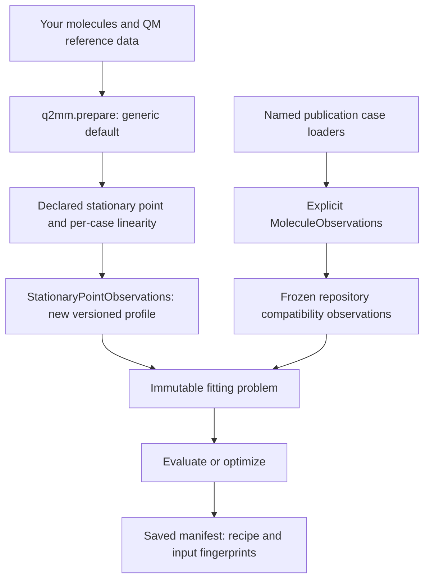
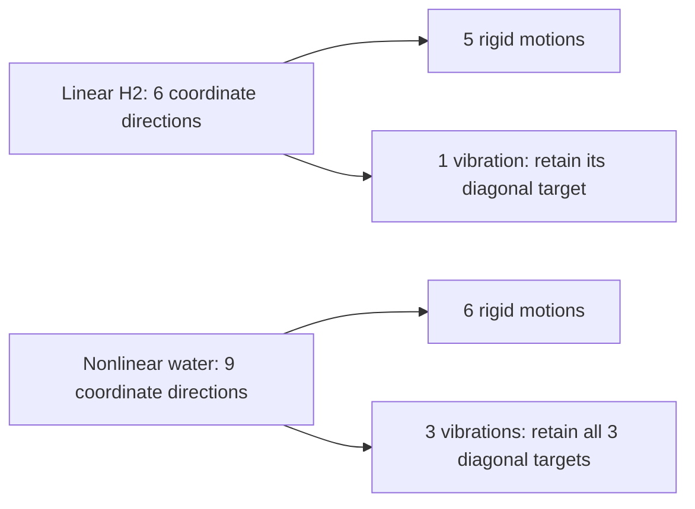

# Fitting objectives and reference data

A fitting objective measures how far a force field's predictions are from
your reference data. Q2MM's optimizer tries to reduce that score. Choosing
which measurements contribute changes the scientific problem: a vibration
with zero weight cannot help determine the fitted parameters.

Generic `q2mm.prepare` now chooses observations using the declared stationary
point and each molecule's linearity. **Publication case loaders** deliberately
keep their existing **repository compatibility profile** instead. This page
explains the difference and how to identify it in a saved run.

## Vocabulary

| Term | Meaning |
|---|---|
| Reference data | Values to reproduce, usually from a quantum-mechanical (QM) calculation. |
| Observation | One reference value, its weight, and the case and measurement it belongs to. |
| Objective | The score comparing observations with molecular-mechanics (MM) predictions. |
| Observation recipe | The rule that turns molecular reference data into an observation set. It is separate from the optimizer recipe. |
| Stationary point | A geometry with zero energy gradient in the ideal calculation. A ground-state minimum and a transition-state saddle have different curvature. |
| Rigid motion | Translation or rotation of the whole molecule without changing its internal shape. |
| Vibration | An internal displacement, such as stretching a bond or bending an angle. |
| Hessian | The matrix describing how energy curves with atomic displacements. |
| Normal mode | An eigenvector of the mass-weighted Hessian: a collective displacement direction. |
| Eigenmatrix | A Hessian expressed in the reference normal-mode basis. Diagonals describe curvature; off-diagonals compare mode coupling. |

For the geometry/eigenmatrix observations discussed here, Q2MM multiplies
each residual by its weight **before squaring**:

$$
\text{data score} = \sum_i \left[w_i
  \left(x_{\mathrm{reference},i}-x_{\mathrm{MM},i}\right)\right]^2 .
$$

A zero weight therefore removes that observation's contribution, even though
the record remains in the set. Optional parameter regularization is a separate
term. See [observation types](data-types.md) for individual measurements.

## Choose the route, not just the starting parameters



| Route | Observation identity and behavior |
|---|---|
| Generic `prepare`, observations omitted | [`stationary-point-geometry-eigenmatrix-v1`](#the-generic-mode-selection-rule): ground states retain their physical vibrational targets under the count-based selection assumption. |
| Explicit `MoleculeObservations()` | [`repository-geometry-eigenmatrix-v1`](#publication-case-loaders-and-compatibility): preserves the existing exclusions, including for ground states. |
| Publication case loaders, such as `load_system("rh-enamide", ...)` | [Source-backed case membership and frozen observations](../tutorial.md#first-full-case-rh-enamide); not an exact paper reproduction. |
| Explicit `ObservationSet` | [Caller-specified observations](data-types.md); kept unchanged, with preparation profile `explicit-observation-set-v1`. |
| `MatchedFrequencyObservations` | [Separate frequency-matching recipe](../reference/q2mm/preparation.md), profile `matched-frequency-v1`; unchanged by this correction. |

QFUERZA initialization and observation selection are separate decisions.
For a declared transition state, QFUERZA replaces negative curvature during
initial-parameter generation so the MM model can represent that TS geometry
as a **minimum**, not a saddle. The observation recipe still uses the
**unmodified QM reference Hessian**. Unconstrained MM relaxation remains
intended; this change does not define a new relaxation or local-basin policy.

## Why H2 and water need different counts

Each atom has three coordinate directions. An isolated linear molecule has
five independent rigid motions; a nonlinear molecule has six. The remaining
directions describe internal vibration:



The former generic default reserved the first mode as a reaction mode and
then excluded six more rigid candidates, regardless of the declared
stationary point or linearity.

| Ground-state example | Former generic default / explicit compatibility | Corrected generic default | Evidence |
|---|---|---|---|
| Harmonic H2 | No weighted vibrational diagonal | One weighted vibrational diagonal | [Mode-accounting and compatibility regressions](https://github.com/ericchansen/q2mm/blob/master/test/test_preparation.py) |
| Harmonic water | Two weighted vibrational diagonals | Three weighted vibrational diagonals | [Mode-accounting and compatibility regressions](https://github.com/ericchansen/q2mm/blob/master/test/test_preparation.py) |

These are analytic harmonic test systems with the appropriate rigid
nullspace, not reported ab initio frequencies or optimization benchmarks.
All full-spectrum diagonal and lower-triangle off-diagonal records are still
stored. **Stored target count is not weighted target count.**

## The generic mode-selection rule

`StationaryPointObservations` retains the existing **unprojected,
mass-weighted QM normal-mode basis**. The QM and MM Hessians are compared in
that same basis. Input Hessians use Hartree/Bohr squared; mass weighting gives
eigenmatrix values in Hartree/(atomic mass unit times Bohr squared).

1. Infer linearity from the mass-centered coordinates, or use an explicit
   override. Choose five rigid candidates for linear molecules, six otherwise.
2. For a declared ground state, exclude only that many smallest-magnitude
   eigenvalues.
3. For a declared transition state, first reserve full-spectrum mode index
   zero, then choose the rigid candidates from the remaining eigenvalues.
4. Zero-weight excluded diagonals and any off-diagonal touching an excluded
   mode. Keep the original reference values and full-spectrum indices.

The retained residual multipliers are 10 for bond lengths, 5 for bond angles,
0.1 for eigenmatrix diagonals and 0.05 for off-diagonals. These are the
repository recipe's weights, not universally prescribed values from the
papers. There is no renormalization when a corrected recipe retains more
targets.

### Near-linear geometry and explicit overrides

Automatic classification uses the singular values of mass-centered
coordinates, with each atom weighted by its square-root mass. A molecule is
linear when the second/largest singular-value ratio is at most
`linearity_tolerance`, whose default is `1e-8`; otherwise it is nonlinear.
Two distinct atoms are always linear, even at a sub-roundoff tolerance.
There is no forbidden near-linear band.

This threshold is an **engineering choice**, not a paper-mandated physical
cutoff. For a near-linear structure, inspect the recorded ratio and state
your intended convention explicitly if needed:

```python
import q2mm
from q2mm.preparation import StationaryPointObservations

problem = q2mm.prepare(
    molecule,
    stationary_point="ground_state",
    force_field=force_field,
    initialize="provided",
    observations=StationaryPointObservations(linearity="linear"),
)
case_details = problem.preparation_provenance.observation_recipe["cases"][0]
print(case_details["inferred_linearity"], case_details["resolved_linearity"])
```

Alternatively, supply a finite `linearity_tolerance` between zero and one.
Automatic classification is per case. An explicit override applies to every
case in that preparation request; mixed GS/TS sets and heterogeneous explicit
overrides still use advanced explicit-observation/problem construction.

The generic recipe requires at least two atoms, finite geometry/Hessian,
supported masses and nonzero molecular extent. A nonlinear diatomic override
is invalid. Atomic or non-vibrational problems can use explicit observations.

Reference Hessians must also be symmetric within the engineering tolerance
`norm(H - H.T) <= 1e-12 + 1e-8 * norm(H)`, using the Frobenius norm (the
square root of the sum of squared matrix entries) and canonical
Hartree/Bohr squared units. This rotation-invariant check allows numerical
roundoff while rejecting inconsistent matrix triangles before mode selection.
The tolerances are recorded in `hessian_symmetry` recipe details.
Q2MM does not symmetrize or otherwise replace the reference; explicit
compatibility and caller-specified observations do not acquire this check.

### What the selection does not establish

Count-based exclusion assumes rigid candidates occupy the smallest
eigenvalue magnitudes after reserving the TS mode. It does not project out
rigid motion or prove physical mode identity. Approximate QM stationary
geometries can have small nonzero rotational curvatures; extra soft or
degenerate modes can make this assumption ambiguous.

There is **no new requirement for exactly five/six near-zero eigenvalues**.
A negative retained reference diagonal produces a warning and a recorded
diagnostic, not automatic TS reclassification or a changed reference.
A declared TS with nonnegative reserved curvature also produces a warning.
Neither warning proves physical instability, and neither is an acceptance
or convergence result. Excluded small negative rigid candidates do not
trigger the retained-curvature warning.

## Publication case loaders and compatibility

Named publication case loaders explicitly use `MoleculeObservations()` and
retain the repository compatibility profile's observations, weights and
case order. `ObservationSet.from_molecule(s)` also retains its current
compatibility-builder behavior; it is not the new generic default.
The separately named Ferrocene seven-structure profile retains its own
identity and existing observations.

This compatibility profile is a **partial repository objective**, not exact
publication reproduction. Missing source categories and case membership
limitations remain in the canonical
[Publication Force-Field Coverage](https://github.com/ericchansen/q2mm/blob/master/validation/published_ffs/README.md)
records. The default correction neither fills those gaps nor changes their
status.

There is also a specific TS distinction: Limé and Norrby's Method D retains
reaction-mode off-diagonal terms while excluding the reaction eigenvalue.
Both repository recipes discussed here retain the existing **reaction row
and column exclusion**, so neither should be called exact Method D.

## Compare saved identities before comparing scores

The manifest written by `q2mm.save(run, ...)` records
`provenance.preparation.profile`, the observation recipe and its per-case
masks/diagnostics, and `provenance.preparation_fingerprint`. The scientific
problem and observation fingerprints remain available separately.

For ground states, newly weighted targets can change the score even at
identical force-field parameters. An old compatibility score and a new
generic score are therefore not a like-for-like before/after optimization
comparison. Evaluate both fields against the **same explicit observations**
when that comparison is needed.

Conversely, a nonlinear TS can have identical observation values/weights
under both recipes and thus the same scientific problem fingerprint, but
different preparation identities. `configuration.recipe_id` names the
optimizer/workflow recipe; it is not the observation profile.
The [saved-provenance regressions](https://github.com/ericchansen/q2mm/blob/master/test/test_preparation.py)
cover these distinctions.

## Sources and boundaries

[Farrugia et al. (2025)](../references.md#methods), main-article pages 2-3,
describes QFUERZA initialization and reference-normal-mode comparisons.
[Limé and Norrby (2014; 2015 issue)](../references.md#methods),
pages 1-3, describes the mass-weighted basis, five/six rigid motions,
TS-as-MM-minimum construction and Method D. Citation years follow the
Zotero-checked bibliography.

The generic recipe corrects mode accounting while retaining the repository's
existing numerical conventions. It does not claim the paper's projected
basis, a new choice of weights, a full TS fitting protocol, or a validated
local-basin optimization policy.
