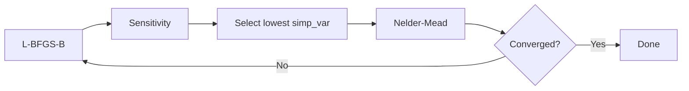

# Optimization Guide

Force field optimization is hard because the objective landscape — the surface
defined by how well MM frequencies match QM reference data — is rarely smooth.
**MM3** landscapes are rugged with many local minima (Buckingham potentials,
coupled torsions). **Harmonic** landscapes are smoother but still
non-trivial from a poor starting point. No single optimizer handles both
cases well.

This guide tells you **what to do** for your system. It recommends concrete
workflows grounded in [CH₃F benchmark evidence](../benchmarks/small-molecules.md),
then links to source code for API details.

---

## Quick-start: which workflow?

| Your system | Recommended workflow | Why |
|-------------|---------------------|-----|
| ≤ 10 params, harmonic form | [Workflow A](#workflow-a-small-smooth) | L-BFGS-B alone reaches the best basin (529 cm⁻¹ RMSD on CH₃F) |
| ≤ 10 params, MM3 form | [Workflow B](#workflow-b-small-rugged) | Multi-start finds basins single-start misses (28.7 vs 579 RMSD) |
| 10–50 params, any form | [Workflow C](#workflow-c-medium-systems) | Grad-simp cycling combines gradient speed with simplex robustness |
| 50+ params | [Workflow C](#workflow-c-medium-systems) + [L2](#l2-regularization) | Regularization prevents parameter drift in under-determined systems |

Every workflow assumes **QFUERZA initialization** — run
`estimate_force_constants()` before optimization. QFUERZA puts you in the
right neighbourhood; the optimizer refines from there.

---

## Workflow A: Small + Smooth

**When:** ≤ 10 parameters, harmonic functional form, analytical gradients
available.

**Recipe:** One call to L-BFGS-B with analytical gradients. Done.

```python
from q2mm.optimizers.scipy_opt import ScipyOptimizer

optimizer = ScipyOptimizer(method="L-BFGS-B", maxiter=500, jac="auto")
result = optimizer.optimize(objective)
print(result.summary())
```

**Why this works:** On smooth harmonic landscapes, L-BFGS-B's curvature
information reaches the best basin in the fewest evaluations. On CH₃F
harmonic, L-BFGS-B with analytical gradients achieves 529 cm⁻¹ RMSD in
~2 seconds. Basin-hopping, multi-start, and optax Adam all match or
slightly beat this (~526–531), but none find a meaningfully better basin —
the harmonic landscape simply doesn't have hidden minima worth searching
for.

**What doesn't work here:**

- **Optax Adam** (990–1001 RMSD) — adaptive learning rates can't exploit
  curvature the way L-BFGS-B can on a smooth surface
- **L2 regularization** (993 RMSD) — the penalty prevents parameters from
  reaching the deep basin. Don't regularize well-conditioned problems.
- **FD-only gradients** (1048 RMSD) — finite-difference frequency gradients
  are too noisy to guide L-BFGS-B from the QFUERZA starting point

---

## Workflow B: Small + Rugged

**When:** ≤ 10 parameters, MM3 or other non-harmonic functional form.

**Recipe:** Multi-start L-BFGS-B to find the best basin.

```python
from q2mm.optimizers.multistart import MultiStartOptimizer
from q2mm.optimizers.scipy_opt import ScipyOptimizer

# Multi-start global search
inner = ScipyOptimizer(method="L-BFGS-B", maxiter=500, jac="auto")
multi = MultiStartOptimizer(
    optimizer=inner,
    n_starts=10,
    perturbation_pct=0.1,
    seed=42,
)
result = multi.optimize(objective)
```

**Why this works:** The MM3 landscape has many local minima. Single-start
L-BFGS-B gets trapped at 579 cm⁻¹ RMSD on CH₃F — a poor basin. Running
10 starts from perturbed initial points finds basins that single-start
misses:

| Strategy | CH₃F MM3 RMSD | Notes |
|----------|-------------:|-------|
| L-BFGS-B (single start) | 579.0 | Stuck in poor local minimum |
| L-BFGS-B + L2(λ=0.01) | 133.5 | L2 steers away from the bad basin |
| optax Adam | 56.3 | Momentum navigates rugged landscape |
| **multi-start n=10 (OpenMM)** | **28.7–46.2** | **Best strategy — stochastic, varies by run** |

Multi-start is the recommended approach because it's simple and consistently
finds the best basins on rugged landscapes.

**Does Adam refinement help after multi-start?** In
[composed benchmarks](../benchmarks/small-molecules.md#composed-workflows),
running optax Adam from the multi-start winner barely changed the result:
46.2 → 46.1 on OpenMM (FD gradients limit Adam), 563.8 → 563.8 on JAX
(same local minimum). Multi-start alone finds the basin; refinement adds
diminishing returns.

**Alternatives that also work:**

- **[Basin-hopping](https://docs.scipy.org/doc/scipy/reference/generated/scipy.optimize.basinhopping.html)**
  with T=0.5 improved on single-start L-BFGS-B (514 vs 579) but didn't
  match multi-start n=10 (28.7). Basin-hopping is more sensitive to
  temperature tuning — T=1.0 produced the *worst* result (1105 RMSD) by
  accepting too many uphill moves.
- **L2 regularization** (λ=0.01) improved single-start L-BFGS-B by 4×
  (579 → 134) by preventing parameter drift into the bad basin. It's a
  good safety net when you can't afford multi-start.

**What doesn't work here:**

- **Multi-start on JAX** (579–586 RMSD) — JAX's analytical gradients
  consistently converge to the same local minimum regardless of starting
  point. The OpenMM FD gradient noise actually helps escape this basin.
  This is a case where FD noise acts as implicit regularization.

---

## Workflow C: Medium and Large Systems

**When:** 10+ parameters, any functional form. This is the
production workflow.

**Recipe:** Grad-simp cycling — alternating L-BFGS-B full-space passes
with Nelder-Mead on the most sensitive parameters.

```python
from q2mm.optimizers.cycling import OptimizationLoop

loop = OptimizationLoop(
    objective,
    max_params=3,         # simplex on top 3 params per cycle
    max_cycles=10,        # up to 10 grad-simp cycles
    convergence=0.01,     # stop when <1% improvement per cycle
    full_method="L-BFGS-B",
    simp_method="Nelder-Mead",
    full_maxiter=200,
    simp_maxiter=200,
    full_jac="auto",      # analytical gradients where available
    verbose=True,
)
result = loop.run()
print(result.summary())
```

**How it works:** Each cycle:

1. **Full-space gradient pass** — L-BFGS-B on all N parameters
2. **Sensitivity analysis** — rank every parameter by `simp_var = d2/d1²`
   (high gradient response relative to curvature = best for simplex)
3. **Subspace simplex** — Nelder-Mead on the top `max_params` parameters
4. **Convergence check** — stop when improvement drops below threshold



**Why this works:** L-BFGS-B quickly converges most parameters, then
Nelder-Mead polishes the stubborn ones that gradients can't handle.
On Rh-enamide (182 parameters, MM3), grad-simp achieves the best
observed score (3.29 with OpenMM) — better than either L-BFGS-B (5.81) or
Nelder-Mead (5.11) alone.

!!! info "Why only 3 parameters per simplex pass?"
    Nelder-Mead creates an (N+1)-vertex simplex. With 3 parameters that's
    4 vertices; with 20 it's 21 — and convergence slows significantly.
    `max_params=3` keeps simplex passes fast while addressing the most
    problematic parameters each cycle.

### Composing with global search

You can use multi-start as the gradient phase inside grad-simp cycling
via the `full_method="multi:L-BFGS-B"` parameter:

```python
from q2mm.optimizers.cycling import OptimizationLoop

loop = OptimizationLoop(
    objective,
    max_params=3,
    max_cycles=5,
    full_method="multi:L-BFGS-B",  # multi-start each gradient phase
    simp_method="Nelder-Mead",
    full_jac="auto",
)
result = loop.run()
```

!!! warning "Evidence: this composition doesn't outperform plain cycling"
    In [CH₃F benchmarks](../benchmarks/small-molecules.md#composed-workflows),
    grad-simp with multi-start inner achieved **592 RMSD on OpenMM** and
    **527 RMSD on JAX** — comparable to or worse than plain grad-simp
    (586 / 579). The random restarts within each cycle disrupt inter-cycle
    convergence. For rugged landscapes, multi-start alone
    ([Workflow B](#workflow-b-small-rugged)) is more effective than
    embedding multi-start inside cycling.

### Adding L2 regularization to cycling

For under-determined systems (more parameters than independent
observations), add L2 to the objective:

```python
objective = ObjectiveFunction(
    forcefield=ff,
    engine=engine,
    molecules=molecules,
    reference=reference,
    regularization=0.01,   # keeps params near QFUERZA values
)

loop = OptimizationLoop(objective, max_params=3, max_cycles=10)
result = loop.run()
```

The L2 penalty flows through every evaluator automatically — no
optimizer-specific code needed.

---

## Modifiers

These cross-cutting options layer onto any workflow.

### L2 Regularization

Penalizes parameter drift from the starting values (QFUERZA estimates).
The total loss becomes:

$$\text{loss}_\text{total} = \text{loss}_\text{data} + \lambda \cdot \| \mathbf{p} - \mathbf{p}_\text{ref} \|^2$$

```python
objective = ObjectiveFunction(
    forcefield=ff, engine=engine,
    molecules=molecules, reference=reference,
    regularization=0.01,      # λ — penalty strength
    # reference_params=...    # defaults to initial FF params
)
```

**When it helps:** Rugged MM3 landscapes where single-start optimizers
find poor local minima. On CH₃F MM3, L2 improved L-BFGS-B by 4×
(579 → 134 RMSD). Also useful for under-determined systems (more
parameters than observations).

**When it hurts:** Well-conditioned problems. On CH₃F harmonic, L2
*doubled* the RMSD (529 → 993) by preventing parameters from reaching
the optimal basin.

!!! tip "Choosing λ"
    Start with 0.001–0.01. Increase until parameters stay close to
    QFUERZA values. Aim for the penalty term to be ~1–10% of data loss
    at the optimum. Too large = can't improve; too small = no effect.

L2 works with **every** optimizer — [SciPy](https://docs.scipy.org/doc/scipy/reference/optimize.html),
[optax](https://optax.readthedocs.io/), basin-hopping, multi-start, and
grad-simp — because it modifies the
[`ObjectiveFunction`](https://github.com/ericchansen/q2mm/blob/master/q2mm/optimizers/objective.py),
not the optimizer.

### Sensitivity Analysis

A diagnostic tool that ranks parameters by how the objective responds to
perturbation, using the ratio `simp_var = d2/d1²`. Low `simp_var` means
the parameter strongly affects the objective relative to its curvature —
these are parameters where simplex outperforms gradient methods.

```python
from q2mm.optimizers.cycling import compute_sensitivity

sens = compute_sensitivity(objective, metric="simp_var")
labels = ff.get_param_type_labels()
for rank, idx in enumerate(sens.ranking):
    print(f"  {rank+1}. {labels[idx]:12s}  "
          f"d1={sens.d1[idx]:+.4f}  simp_var={sens.simp_var[idx]:.4f}")
```

Use this to understand your landscape before choosing a workflow, or to
debug why optimization stalls.

!!! note "Cost"
    Sensitivity analysis requires **2N + 1** objective evaluations in the
    worst case (one baseline plus two perturbations per parameter).

---

## Optimizer Reference

For constructor parameters, return types, and full API details, see the
[API Reference](../reference/q2mm/optimizers/).

### Gradient modes

All gradient-using optimizers support three modes via the `jac` parameter:

| Mode | What it does | When to use |
|------|-------------|-------------|
| `jac=None` | SciPy finite-difference | Default; works everywhere but noisy |
| `jac="auto"` | Analytical where available, FD fallback | **Recommended** — best quality gradients |
| `jac="analytical"` | Forces analytical only | Only if all evaluators support it |

Analytical gradients produce the best results on harmonic problems. The
top harmonic results on CH₃F all use analytical or auto mode.

---

## Tips and Pitfalls

!!! warning "L-BFGS-B may not fully converge on rugged landscapes"
    On CH₃F MM3, L-BFGS-B gets trapped at 579 cm⁻¹ RMSD — a poor local
    minimum. Use multi-start or optax Adam on MM3 forms. On smooth
    harmonic forms, L-BFGS-B is the best choice.

!!! tip "QFUERZA initialization matters"
    Starting from QFUERZA-estimated parameters puts you close to the
    optimum. Always run `estimate_force_constants()` before optimization
    when QM data is available.

!!! tip "Monitor convergence"
    Plot `result.history` (single-shot) or `result.cycle_scores` (cycling)
    to visualize convergence. If the score plateaus early, the optimizer
    may be stuck — try multi-start or switch the sensitivity metric to
    `"abs_d1"`.

!!! info "Backend speed"
    Per-evaluation cost on CH₃F (8 parameters), from derivative-free
    methods:

    | Backend | Per-eval | vs Tinker |
    |---------|---------|-----------|
    | JAX (GPU) | ~2.5 ms | 96× faster |
    | OpenMM (GPU) | ~10 ms | 24× faster |
    | Tinker (CPU) | ~240 ms | baseline |

!!! info "FD noise as implicit regularization"
    On CH₃F MM3, OpenMM multi-start n=10 (FD gradients) achieved 28.7
    RMSD while JAX multi-start n=10 (analytical gradients) stayed at 586.
    The FD gradient noise helped OpenMM escape the local minimum that
    JAX's precise gradients consistently converge to. This is an unusual
    case where lower-quality gradients produced a better result.

---

## Further Reading

- [Tutorial: Step 6 — Optimize](../tutorial.md#step-6-optimise-the-force-field) — walkthrough of a single-shot optimization
- [CH₃F Benchmarks](../benchmarks/small-molecules.md) — full 71-combo comparison matrix with RMSD, timing, and per-eval costs
- [Rh-Enamide Benchmarks](../benchmarks/rh-enamide.md) — large-system case study (182 parameters)
- [References](../references.md) — academic papers describing the Q2MM methodology
