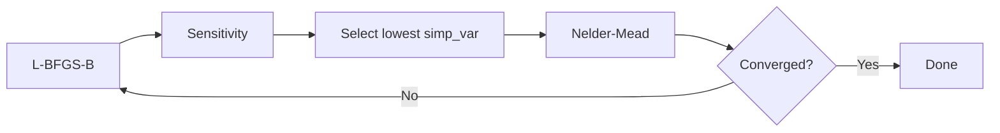

# Optimization Guide

Q2MM provides three optimization strategies with increasing sophistication.
This page explains each one and when to use it.

---

## Choosing a strategy

We don't yet have enough benchmark data across system sizes to give
confident thresholds for when to switch strategies. Here's what we know
so far:

| Strategy | What it does | What we've observed |
|----------|-------------|---------------------|
| `ScipyOptimizer("Nelder-Mead")` | Derivative-free simplex on all params | Low optimization scores on both CH₃F and Rh-enamide, but final RMSD can be poor (1038 cm⁻¹ on CH₃F harmonic). Needs many evaluations. |
| `ScipyOptimizer("L-BFGS-B")` | Gradient-based on all params | Fewest evaluations; with analytical gradients, reaches much better RMSD than Nelder-Mead on CH₃F (30.4 vs 564 on MM3). FD gradients are weaker. |
| `OptimizationLoop(max_params=3)` | Grad-simp cycling | Best overall scores on Rh-enamide: JAX MM3 scored 3.54 in 25 min, OpenMM MM3 scored 3.29 in 9 hrs. JAX-MD harmonic scored 11.66 (different functional form). JAX harmonic not yet re-run post-fix. |
| `SubspaceObjective` + manual | Optimise specific params | For expert users; not benchmarked |
| `compute_sensitivity()` | Rank parameter sensitivity | Diagnostic tool, not an optimizer |

---

## The problem: why one method isn't enough

Force field optimization is a balancing act between **exploration** (searching
the parameter space broadly) and **exploitation** (following gradients to the
nearest minimum). No single optimizer excels at both:

| | Gradient methods (L-BFGS-B) | Simplex methods (Nelder-Mead) |
|-----------|---------------------------|-------------------------------|
| Convergence speed | ✅ Converges in fewer evaluations | ❌ Needs many more evaluations |
| Solution quality | ❌ Can get stuck at suboptimal solutions | ✅ More robust on complex surfaces |
| Gradients needed | ⚠️ Yes — quality depends on gradient source | ✅ Derivative-free |

Q2MM solves this by combining both in a **cycling
loop**: gradient methods handle the bulk of convergence, then simplex polishes
the parameters that gradients struggle with.

---

## Strategy 1: Single-Shot Optimizer

The simplest approach — run one optimizer on all parameters at once.

```python
from q2mm.optimizers.scipy_opt import ScipyOptimizer

optimizer = ScipyOptimizer(method="L-BFGS-B", maxiter=500, eps=1e-3)
result = optimizer.optimize(objective)
print(result.summary())
```

### When to Use

- **≤ 10 parameters** — small force fields where any method converges quickly
- **Quick iteration** — you want a fast answer, even if not fully converged
- **Seminario-initialized** — when the starting point is already close to optimal

### Available methods

| Method | Type | Notes |
|--------|------|-------|
| `Nelder-Mead` | Simplex | Derivative-free, robust; no bounds support |
| `L-BFGS-B` | Quasi-Newton | Fast, bounded; may not fully converge (see below) |
| `Powell` | Direction-set | Derivative-free; more evaluations than Nelder-Mead |
| `least_squares` | Levenberg-Marquardt | Exploits residual structure |
| `trust-constr` | Trust-region | Supports constraints |

### What the benchmarks show

On **CH₃F** (8 parameters, Seminario-initialized):

| Method | Score (harmonic, JAX) | Score (MM3, JAX) | Evals (harmonic) | Evals (MM3) |
|--------|----------------------|------------------|------------------|-------------|
| Nelder-Mead | 0.0000 | 0.0001 | 1,202 | 14,417 |
| L-BFGS-B | 0.0000 | 0.0007 | 151 | 77 |
| Powell | 0.0000 | 0.0001 | 2,541 | 12,034 |

On **Rh-enamide** (182 parameters, MM3, JAX):

| Method | Final Score | Evals |
|--------|-------------|-------|
| Nelder-Mead | 5.11 | 10,668 |
| L-BFGS-B | 5.81 | 142 |

L-BFGS-B converges in far fewer evaluations but doesn't always reach the
same final score. On OpenMM the gap is larger — L-BFGS-B scores 0.087
vs 0.000 for Nelder-Mead on CH₃F harmonic.

!!! note "Gradient modes"
    `ScipyOptimizer` supports three gradient modes via the `jac` parameter:

    - `jac=None` — SciPy finite-difference (default)
    - `jac="auto"` — uses analytical gradients when the engine supports
      them, with FD fallback for evaluators that lack analytical support
    - `jac="analytical"` — forces analytical gradients

    The benchmark runner uses `jac="auto"` for single-shot gradient methods.
    JAX, JAX-MD, and OpenMM all support analytical gradients, so L-BFGS-B
    benchmarks on these backends use a hybrid of analytical and FD gradients.
    Each benchmark JSON records the per-evaluator gradient mode in
    `metadata.gradients` (e.g., ``{"energy": "analytical", "frequency":
    "finite-diff"}``).

---

## Strategy 2: Grad-Simp Cycling

The flagship optimization strategy, based on Norrby & Liljefors
([*J. Comput. Chem.* **1998**, 19, 1146](https://doi.org/10.1002/(SICI)1096-987X(19980730)19:10%3C1146::AID-JCC4%3E3.0.CO;2-M)).
Each cycle:

1. **Full-space gradient pass** — L-BFGS-B on all N parameters
2. **Sensitivity analysis** — rank every parameter by how the objective
   responds to perturbation
3. **Subspace simplex** — Nelder-Mead on the top `max_params` parameters
   (ranked by `simp_var`, see below)
4. **Convergence check** — stop when improvement drops below threshold

```python
from q2mm.optimizers.cycling import OptimizationLoop

loop = OptimizationLoop(
    objective,
    max_params=3,         # simplex on top 3 params per cycle
    max_cycles=10,        # up to 10 grad-simp cycles
    convergence=0.01,     # stop when <1% improvement per cycle
    full_method="L-BFGS-B",
    simp_method="Nelder-Mead",
    full_maxiter=200,
    simp_maxiter=200,
    verbose=True,
)

result = loop.run()
print(result.summary())
```

### When to Use

- **10+ parameters** — where single-shot simplex becomes slow and
  gradients alone leave residual error
- **Production optimizations** — when you need the best possible parameters
- **Stubborn parameters** — when L-BFGS-B converges but leaves a non-trivial
  residual

### How Sensitivity Selection Works

Before each simplex pass, Q2MM perturbs every parameter by its type-specific
step size and computes:

- **d1** — first derivative (how steeply the objective changes)
- **d2** — second derivative (curvature)
- **simp_var = d2 / d1²** — the selection metric

Parameters are ranked by **ascending** `simp_var`. Low `simp_var` means the
objective responds strongly (high |d1|) relative to curvature (d2), which is
exactly where simplex tends to outperform gradient methods.



!!! info "Why only 3 parameters per simplex pass?"
    Nelder-Mead creates an N+1 vertex simplex. With 3 parameters that's
    4 vertices; with 20 it's 21 — and convergence slows significantly.
    The default `max_params=3` keeps simplex passes fast while still
    addressing the most problematic parameters each cycle.

!!! note "Cycling gradient mode"
    The cycling loop defaults to `full_jac=None` (SciPy finite-difference
    gradients for the L-BFGS-B pass). Setting `full_jac="auto"` enables
    analytical gradients where the engine supports them. Both modes are
    included in the CH₃F benchmark matrix as "grad-simp (FD)" and
    "grad-simp (auto)" — see [Small Molecules](../benchmarks/small-molecules.md).

### What the benchmarks show

Grad-simp cycling has only been benchmarked on a few combinations:

| System | Backend | Score | Evals |
|--------|---------|-------|-------|
| CH₃F (harmonic) | JAX (GPU) | 0.0008 | 3,948 |
| CH₃F (MM3) | OpenMM (GPU) | 0.0004 | 2,692 |
| Rh-enamide (MM3) | OpenMM (GPU) | 3.29 | 35,343 |

On Rh-enamide, grad-simp with OpenMM achieves the best score observed
(3.29 vs 5.11 for Nelder-Mead and 5.81 for L-BFGS-B), but at the cost of
many more evaluations. Grad-simp with JAX/JAX-MD on Rh-enamide failed due
to eigendecomposition errors, which have since been fixed
([PR #207](https://github.com/ericchansen/q2mm/pull/207)).

For all `OptimizationLoop` parameters, return values, and defaults, see the
[API reference](../reference/q2mm/optimizers/cycling.md).

---

## Strategy 3: Manual Subspace Optimization

For advanced users who want direct control over which parameters to optimise.
`SubspaceObjective` wraps your full objective and only exposes a subset of
parameters, holding the rest fixed.

```python
from q2mm.optimizers.cycling import SubspaceObjective

# Only optimise bond force constants (indices 0 and 2)
full_vec = ff.get_param_vector()
sub_obj = SubspaceObjective(objective, [0, 2], full_vec)

# Use any scipy method on the small subspace
import scipy.optimize
result = scipy.optimize.minimize(
    sub_obj,
    sub_obj.get_initial_vector(),
    method="Nelder-Mead",
    options={"maxiter": 500},
)

# Apply optimised subspace back to the full force field
best_full = sub_obj.build_full_vector(result.x)
ff.set_param_vector(best_full)
```

### When to Use

- **Expert parameter tuning** — you know exactly which parameters need attention
- **Debugging** — isolate whether a specific parameter type is causing issues
- **Custom cycling strategies** — build your own outer loop with domain knowledge

---

## Standalone sensitivity analysis

You can run sensitivity analysis independently, without the full
grad-simp loop. This is useful for diagnosing which parameters matter most
in your problem.

```python
from q2mm.optimizers.cycling import compute_sensitivity

sens = compute_sensitivity(objective, metric="simp_var")

# Rank parameters from most to least suitable for simplex
labels = ff.get_param_type_labels()
for rank, idx in enumerate(sens.ranking):
    print(f"  {rank+1}. {labels[idx]:12s}  d1={sens.d1[idx]:+.4f}  "
          f"d2={sens.d2[idx]:.4f}  simp_var={sens.simp_var[idx]:.4f}")
```

Expected output:

```
  1. bond_k        d1=+0.3421  d2=0.0012  simp_var=0.0102
  2. angle_eq      d1=-0.1893  d2=0.0089  simp_var=0.2483
  3. bond_eq       d1=+0.0542  d2=0.0031  simp_var=1.0541
  4. angle_k       d1=-0.0103  d2=0.0002  simp_var=1.8856
```

!!! note "Cost"
    Sensitivity analysis requires **2N + 1** objective evaluations in the
    worst case (one baseline plus two perturbations per parameter).
    Parameters at bounds are skipped, reducing the count.

---

## Tips and pitfalls

!!! warning "L-BFGS-B may not fully converge"
    On CH₃F (8 parameters), L-BFGS-B final scores range from 0.0000 (JAX,
    harmonic) to 0.087 (OpenMM, harmonic), while Nelder-Mead consistently
    reaches 0.0000–0.0001. However, low scores don't always mean low RMSD:
    Nelder-Mead reaches score ≈ 0 on harmonic but RMSD 1038 cm⁻¹, while
    L-BFGS-B with analytical gradients reaches RMSD 553 cm⁻¹. On Rh-enamide
    (182 parameters, MM3), JAX L-BFGS-B converges to 5.81 vs 5.11 for
    Nelder-Mead. The grad-simp loop exists to combine the strengths of both.

!!! tip "Seminario initialization matters"
    Starting from Seminario-estimated parameters (extracted from the QM
    Hessian) puts you much closer to the optimum. The optimizer then needs
    fewer evaluations to converge. Always use
    `estimate_force_constants()` before optimization when QM data is
    available.

!!! tip "Monitor convergence"
    Plot `result.history` (for single-shot) or `result.cycle_scores`
    (for cycling) to visualize convergence. If the score plateaus early,
    the optimizer may be stuck — try increasing `max_params` or switching
    the sensitivity metric to `"abs_d1"`.

!!! info "Backend speed comparison"
    Per-evaluation cost on CH₃F (8 parameters), measured from
    derivative-free methods (Nelder-Mead, Powell):

    | Backend | Per-eval Cost | Relative to Tinker |
    |---------|--------------|-------------------|
    | JAX (GPU) | ~2.5 ms | ~96× faster |
    | OpenMM (GPU) | ~10 ms | ~24× faster |
    | Tinker (CPU) | ~240 ms | baseline |

    L-BFGS-B per-eval cost is higher (~43 ms on JAX, ~172 ms on OpenMM)
    because each evaluation includes gradient computation. These numbers
    are from the CH₃F full-matrix rerun — see
    [Small Molecules](../benchmarks/small-molecules.md).

---

## Further reading

- [Tutorial: Step 6 — Optimize](../tutorial.md#step-6-optimise-the-force-field) — full walkthrough of a single-shot optimization
- [Benchmarks](../benchmarks/index.md) — benchmark results across systems, backends, and methods
- [References](../references.md) — academic papers describing the Q2MM methodology
