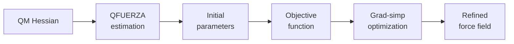
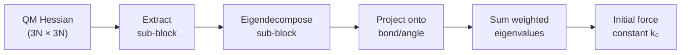
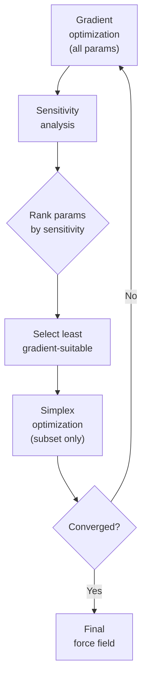

# Theory & Methods

This page explains the full Q2MM pipeline — from a quantum mechanical
calculation to a production-ready force field. For code architecture, see
[Architecture](architecture.md). For practical usage, see the
[Optimization Guide](optimization-guide.md).

---

## The pipeline at a glance

Q2MM converts quantum mechanical (QM) reference data into molecular
mechanics (MM) force field parameters through a multi-stage pipeline:



1. **QFUERZA estimation** extracts initial force constants from the QM
   Hessian — a physically informed starting point
2. **Eigenvalue treatment** (Methods C/D/E) handles the negative eigenvalue
   present in transition state Hessians
3. **Objective function** measures how well MM-computed observables
   (energies, frequencies, geometries) match QM reference data
4. **Grad-simp optimization** refines parameters by alternating
   gradient-based and simplex methods

Each stage is described in detail below.

---

## Stage 1: QFUERZA estimation

Q2MM estimates initial force constants from a quantum mechanical Hessian
using Seminario projection (Seminario, *Int. J. Quantum Chem.* **1996**, 60,
1271) with QFUERZA post-processing (Farrugia et al., *J. Chem. Theory
Comput.* **2025**, 22, 469–476,
[DOI:10.1021/acs.jctc.5c01751](https://doi.org/10.1021/acs.jctc.5c01751)).
For each internal coordinate (bond or angle), the method:

1. Extracts the 3×3 Cartesian sub-block of the Hessian for the relevant atoms
2. Eigendecomposes the sub-block
3. Projects each eigenvector onto the bond or angle direction
4. Sums the projected eigenvalues, weighted by the alignment of each
   eigenvector with the internal coordinate
5. For hydrogen angle bends, substitutes the empirical default
   (0.5 mdyn·Å/rad²) because Seminario projection overestimates these by ~2×



The result is a set of initial force constants that reflect the QM
potential energy surface curvature at that geometry. These are much better
starting points than default values from a generic force field — they
put the optimizer in the right region of parameter space from the start.

### Seminario vs QFUERZA

Seminario projection works well for bonds but overestimates hydrogen angle
bend force constants by roughly 2×. QFUERZA fixes this by substituting
the empirical default (0.5 mdyn·Å/rad²) for any angle where either outer
atom is hydrogen — the same default Q2MM uses when no Hessian is available.
For non-hydrogen angles and all bonds, QFUERZA and plain Seminario give
identical results.

QFUERZA is the default. To use plain Seminario projection instead:

```python
from q2mm.models.seminario import estimate_force_constants

# Default — QFUERZA (recommended)
ff = estimate_force_constants(molecule)

# Plain Seminario projection (no H-angle substitution)
ff = estimate_force_constants(molecule, strategy="fuerza")
```

The implementation lives in
[`q2mm.models.seminario`](../reference/q2mm/models/seminario.md).

---

## Stage 2: transition state eigenvalue treatment

For ground-state molecules, Seminario estimation is straightforward — all
eigenvalues are positive, and the force constants are physically meaningful.
Transition states (TSs) are different: they have exactly one negative
eigenvalue in their Hessian, corresponding to the reaction coordinate.

This creates a fundamental tension. MM force fields represent TSs as energy
*minima* — all eigenvalues must be positive. How do you fit MM parameters
to a QM Hessian that has a negative eigenvalue the MM model can't
reproduce?

Limé & Norrby (*J. Comput. Chem.* **2015**, 36, 244–250,
[DOI:10.1002/jcc.23797](https://doi.org/10.1002/jcc.23797)) systematically
tested five methods for handling this, labeled A through E. These methods
address two independent choices: *what data to fit* (A vs B) and *how to
treat the negative eigenvalue* (C, D, or E).

### What data to fit: Methods A and B

Methods A and B differ in *which Hessian elements* are included in the
objective function.


**Method A** ("original Hessian fitting") fits to all elements of the
Cartesian Hessian, using bond-distance-based weighting to distinguish
stretches, bends, torsions, and long-range interactions.

**Method B** ("off-diagonal Hessian fitting") excludes block-diagonal
elements — the 3×3 blocks where both coordinates belong to the same atom.
These are redundant (they're sums of off-diagonal elements) and including
them couples well-fit elements with elements that can't be represented by
the available MM functions. Removing them consistently improves the fit.

!!! note
    Methods A and B are about objective function design, not eigenvalue
    treatment. They're orthogonal to the C/D/E choice below. Q2MM's
    evaluator system (see [Data Types](data-types.md)) addresses this
    same design space through `HessianElementEvaluator` and
    `EigenmatrixEvaluator`.

### How to treat the TS eigenvalue: Methods C, D, and E

Methods C, D, and E use **eigenmode projection** — the QM Hessian is
transformed into the basis of its own eigenvectors, producing a matrix
where the diagonal elements are eigenvalues (vibrational frequencies) and
off-diagonal elements measure how well the MM eigenvectors match the QM
ones. The methods differ in how they handle the reaction-coordinate
eigenvalue.

**Method C** ("forced eigenvalue") replaces the negative reaction-coordinate
eigenvalue with a large positive value before fitting. This forces the MM
force field to treat the TS as a minimum. It works, but the artificial
eigenvalue distorts the fit — neighboring modes get dragged to unnatural
values because they share force constants with the reaction coordinate.

**Method D** ("natural eigenvalue") keeps the natural (negative) eigenvalue
and fits to it directly. This produces dramatically better fits (~13× lower
RMS error in Limé & Norrby's test system) because the optimizer isn't
fighting an artificial constraint. However, some force constants can converge
to zero or negative values — particularly bending constants for angles
adjacent to the reaction coordinate. A force field with zero bending
constants can produce unphysical local minima during conformational
searching.

### What Q2MM implements

| Method | Function | Module |
|--------|----------|--------|
| C | `replace_neg_eigenvalue()` | `q2mm.models.hessian` |
| D | `keep_natural_eigenvalue()` | `q2mm.models.hessian` |

The `ts_method` parameter in `estimate_force_constants()` selects between
C and D.

---

## Functional forms

The force field's **functional form** determines the energy expression used
for each interaction type:

| Form | Bond Energy | Angle Energy | vdW |
|------|-------------|--------------|-----|
| `HARMONIC` | k(r − r₀)² | k(θ − θ₀)² | Lennard-Jones 12-6 |
| `MM3` | k(r − r₀)²[1 − 2.55Δ + …] | k(θ − θ₀)²[1 − 0.014Δ + …] | Buckingham exp-6 |

The functional form is set when loading a force field and validated at
every boundary:

- **Loaders** set `forcefield.functional_form` based on the source format.
- **Savers** reject incompatible forms — e.g., an AMBER frcmod saver
  rejects an MM3-form force field.
- **Engines** validate compatibility before creating a simulation context.

This prevents silent mismatches where MM3 cubic/sextic constants would be
interpreted as harmonic spring constants. The functional form is carried
through the entire pipeline from load to save.

---

## Stage 3: the objective function

With initial parameters in hand, Q2MM needs a way to measure how good a
force field is. The objective function computes:

$$
\chi^2 = \sum_i w_i \bigl(x_{\text{ref},i} - x_{\text{calc},i}\bigr)^2
$$

where $x_{\text{ref},i}$ is a QM reference value, $x_{\text{calc},i}$ is
the corresponding MM-computed value, and $w_i$ is a weight.

Each evaluation runs the MM engine (OpenMM, Tinker, JAX, or JAX-MD) with
the current parameters, computes the requested observables, and compares
them to the QM reference. The types of observables that can be included
are:

| Observable | Evaluator | What it measures |
|-----------|-----------|------------------|
| Energy | `EnergyEvaluator` | Relative conformational energies |
| Frequency | `FrequencyEvaluator` | Vibrational frequencies (cm⁻¹) |
| Geometry | `GeometryEvaluator` | Bond lengths, angles, torsions |
| Hessian elements | `HessianElementEvaluator` | Individual Hessian matrix entries (Methods A/B) |
| Eigenmatrix | `EigenmatrixEvaluator` | Eigenmode-projected Hessian (Methods C/D/E) |

Weights control the balance between observable types. Getting the weighting
right is important — for example, giving too much weight to energies can
produce a force field with good relative energies but poor geometries.

The implementation lives in
[`q2mm.optimizers.objective`](../reference/q2mm/optimizers/objective.md).

---

## Stage 4: optimization

### Why not just use QFUERZA estimates directly?

QFUERZA parameters capture the local curvature of the QM potential energy
surface at each input geometry. When multiple molecules or conformers are
provided, the estimates are **averaged** across all of them — but
each estimate still reflects curvature at a single point. The resulting force
constants are good initial guesses, but a force field also needs to reproduce
energies, gradients, and torsional profiles across the full conformational
landscape. The initial estimates need refinement to balance all of these
targets.

### Gradient-based optimization

The first pass uses a gradient-based optimizer (L-BFGS-B by default) over
all parameters simultaneously. This efficiently descends the smooth parts
of the objective landscape, handling parameter bounds naturally. For
backends that support analytical gradients (JAX, JAX-MD), this step
benefits from automatic differentiation — no finite differences needed.

### Simplex optimization

Some parameters have steep but shallow-bottomed objective landscapes — the
first derivative is large, but the second derivative is small. Gradient-based
methods like L-BFGS-B struggle here because the finite-difference gradient
estimate can overshoot, causing the optimizer to oscillate rather than
converge. The Nelder-Mead simplex method doesn't use gradients at all; it
evaluates the objective at a simplex of points and reshapes the simplex to
find the minimum, making it robust for these parameters.

The downside: simplex scales poorly with dimensionality. Running it on all
parameters at once is impractical for large force fields. This is where
sensitivity analysis comes in.

### Grad-simp cycling

The grad-simp loop combines the strengths of both methods:



Each cycle:

1. **Full-space gradient pass** — L-BFGS-B over all parameters
2. **Sensitivity analysis** — rank parameters by simplex suitability
3. **Subspace simplex pass** — Nelder-Mead on the parameters where gradient
   methods struggle most (default: bottom 3 by `simp_var`)
4. **Convergence check** — stop when improvement drops below threshold

For each parameter, central finite differences estimate the first and
second derivatives:

```
d1 = (f(x+h) - f(x-h)) / (2h)        # first derivative
d2 = (f(x+h) - 2f(x) + f(x-h)) / h²  # second derivative
```

Parameters are ranked by `simp_var = d2 / d1²`. Low `simp_var` identifies
parameters where the objective is steep but shallow-bottomed — gradient
methods struggle here, but simplex can make progress. The parameters with
the lowest `simp_var` are selected for the simplex pass.

The implementation lives in
[`q2mm.optimizers.cycling`](../reference/q2mm/optimizers/cycling.md).

---

## Numerical safety

Several numerical issues can arise during optimization. Q2MM includes
safety layers that handle them automatically.

### Eigendecomposition robustness

Converting a Hessian matrix to vibrational frequencies requires
eigendecomposition: $H = X^T \Lambda X$, where $\Lambda$ contains the
eigenvalues and $X$ the eigenvectors. In practice:

**Asymmetric Hessians.** By [Schwarz's theorem][schwarz], the Hessian of
any twice continuously differentiable function is symmetric:
$\partial^2 f / \partial x_i \partial x_j = \partial^2 f / \partial x_j \partial x_i$.
In exact arithmetic this always holds for potential energy surfaces.
However, analytical autodiff frameworks (e.g., `jax.hessian`) compute the
two mixed partials via different chains of elementary operations — forward-
over-reverse or reverse-over-forward — and floating-point rounding at each
step can differ. The result is a Hessian that is only *approximately*
symmetric, with off-diagonal discrepancies on the order of machine epsilon
($\sim 10^{-15}$ in float64, $\sim 10^{-7}$ in float32). This is a
[known property of JAX's Hessian computation][jax-hessian-discussion].

LAPACK's `dsyevd` (used by `numpy.linalg.eigvalsh`) assumes *exact*
symmetry and can crash with "Eigenvalues did not converge" when it
encounters asymmetric entries. Q2MM guards against this by symmetrizing
unconditionally before decomposition:

$$H_{\text{sym}} = \tfrac{1}{2}(H + H^T)$$

This is the standard remedy in numerical linear algebra — the symmetric
part of any matrix $A$ is $\tfrac{1}{2}(A + A^T)$, and when the asymmetry
is purely a floating-point artifact, the symmetrized matrix is *closer* to
the true Hessian than the raw autodiff output. The cost is negligible
(one matrix addition) and the fix is applied unconditionally since it is a
no-op for already-symmetric matrices.

[schwarz]: https://en.wikipedia.org/wiki/Symmetry_of_second_derivatives
[jax-hessian-discussion]: https://github.com/jax-ml/jax/discussions/8456

**Non-finite entries.** During optimization the optimizer may trial extreme
parameter values — very large force constants, near-zero equilibrium
lengths, or values at the edge of physical plausibility. When these are
fed into an MM engine, the resulting Hessian can contain `NaN` (e.g.,
division by zero in a force term) or `Inf` (e.g., numeric overflow in an
exponential potential). Passing such a matrix to `numpy.linalg.eigvalsh`
would raise an unrecoverable `LinAlgError`. Q2MM checks
`np.isfinite(H).all()` before attempting eigendecomposition. If any
non-finite entry is found and `on_error="penalty"` is set, it returns
penalty frequencies instead of crashing, allowing the optimizer to
evaluate the objective and retreat from that parameter region.

**Penalty fallback.** Both failure modes above (non-finite entries and
eigendecomposition failure) are handled by the same mechanism: when
`on_error="penalty"` is set, `hessian_to_frequencies()` returns $3N$
copies of a penalty frequency ($10^5\;\text{cm}^{-1}$). This value is
deliberately enormous — typical vibrational frequencies are
$100$–$4000\;\text{cm}^{-1}$. The objective function computes residuals as
$r_i = w_i (x_{\text{ref},i} - x_{\text{calc},i})$, so a calculated
frequency of $10^5$ produces a massive residual against any physical
reference value, giving the parameter set a very high (bad) score. The
optimizer's line-search or simplex contraction naturally retreats from
these regions. The grad-simp cycling loop enables `on_error="penalty"`
automatically during optimisation, so individual failures never crash the
entire run.

### Bound-aware step shrinking

When a parameter is near its bound, the standard perturbation `x ± h` can
push it outside the allowed range. Two approaches exist:


**Exception-based fallback** (used in [q2mm/q2mm](https://github.com/q2mm/q2mm)):
attempt the perturbation, catch the out-of-bounds exception, fall back to
one-sided differences. This produces O(h) truncation error instead of
central differences' O(h²), giving the optimizer noisy, biased sensitivity
information near bounds.

**Symmetric step shrinking** (used in this repository): compute the
effective step size *before* evaluation:

```
h_eff = min(h, upper - x, x - lower)
```

Both perturbations stay within bounds, preserving O(h²) accuracy.

**What happens as a parameter approaches a bound?** As `x` gets closer
to the upper (or lower) bound, `h_eff` shrinks — the perturbation window
narrows. This has two consequences:

1. **Reduced signal-to-noise.** Smaller perturbations produce smaller
   differences in the objective function. The finite-difference gradient
   and curvature estimates become noisier as they approach the precision
   floor. However, the estimates remain *unbiased* (symmetric central
   difference), unlike the O(h) one-sided fallback.

2. **At the bound itself** (`h_eff = 0`): the parameter is **skipped**
   entirely in sensitivity analysis. It receives `d1 = 0` and
   `simp_var = ∞`, which excludes it from the simplex refinement phase.

The parameter does *not* get stuck, though. The gradient-based phase
(L-BFGS-B) handles bounds natively using projected gradients — it doesn't
rely on our finite-difference step sizes. So even when a parameter sits
at a bound, L-BFGS-B can move it away if the gradient points inward. The
only effect is that bound-adjacent parameters won't be selected for
simplex refinement, which is a mild optimality trade-off rather than a
correctness problem.

---

## References

- Seminario, J. M. *Int. J. Quantum Chem.* **1996**, 60, 1271–1277.
  [DOI:10.1002/(SICI)1097-461X(1996)60:7<1271::AID-QUA8>3.0.CO;2-W](https://doi.org/10.1002/(SICI)1097-461X(1996)60:7%3C1271::AID-QUA8%3E3.0.CO;2-W)
- Limé, E.; Norrby, P.-O. *J. Comput. Chem.* **2015**, 36, 244–250.
  [DOI:10.1002/jcc.23797](https://doi.org/10.1002/jcc.23797)
- Farrugia, M.; Helquist, P.; Norrby, P.-O.; Wiest, O.
  *J. Chem. Theory Comput.* **2025**, 22, 469–476.
  [DOI:10.1021/acs.jctc.5c01751](https://doi.org/10.1021/acs.jctc.5c01751)
- Norrby, P.-O.; Liljefors, T. *J. Comput. Chem.* **1998**, 19, 1146–1166.
  [DOI:10.1002/(SICI)1096-987X(19980730)19:10<1146::AID-JCC4>3.0.CO;2-M](https://doi.org/10.1002/(SICI)1096-987X(19980730)19:10%3C1146::AID-JCC4%3E3.0.CO;2-M)
