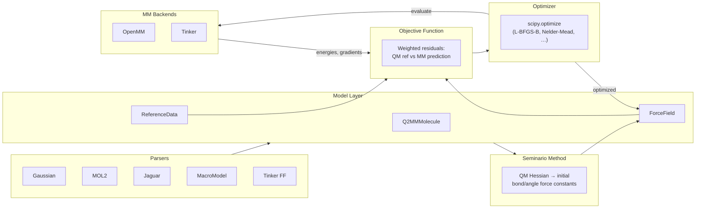

# Q2MM

**Quantum-guided Molecular Mechanics** (Q2MM) is a force field optimization framework
that derives high-quality MM parameters directly from quantum mechanical reference data.
By systematically minimizing the difference between QM-calculated and MM-calculated
molecular properties — energies, geometries, and vibrational frequencies — Q2MM
produces force fields with near-QM accuracy at a fraction of the computational cost.

---

## Why Q2MM?

- **QM accuracy, MM speed** — Parameterize force fields that reproduce QM results
  without the QM runtime cost.
- **Hessian-informed starting points** — The Seminario method extracts bond and angle
  force constants from the QM Hessian, giving the optimizer a physically motivated
  initial guess.
- **Open-source backends** — First-class support for OpenMM and Psi4 alongside
  commercial packages (Tinker, Gaussian, Schrödinger).
- **Robust optimization** — Leverages `scipy.optimize` methods (L-BFGS-B, Nelder-Mead,
  trust-constr, Powell, least-squares) instead of custom gradient code.
- **Clean model layer** — `ForceField`, `Q2MMMolecule`, and `ReferenceData` objects
  decouple algorithms from file formats, making it straightforward to add new parsers
  or backends.

---

## Architecture

**Pipeline overview:**

1. **Parsers** read QM output files (Gaussian, Jaguar) and structure files (MOL2,
   MacroModel, Tinker) into unified `Q2MMMolecule` and `ReferenceData` objects.
2. **Seminario method** projects the QM Hessian onto internal coordinates to extract
   physically motivated initial bond and angle force constants.
3. **Objective function** computes weighted residuals between QM reference values and
   MM-calculated properties for the current parameter set.
4. **Optimizer** drives `scipy.optimize` to minimize the objective, iterating over
   parameter updates.
5. **MM backends** (OpenMM or Tinker) evaluate energies and gradients at each
   optimization step.

---

## What's New

The recent refactoring modernized Q2MM around three goals:

!!! success "Open-source first"
    OpenMM and Psi4 are now first-class backends, so a fully open-source
    QM → FF optimization pipeline is possible without any commercial licenses.

!!! success "Clean model layer"
    A dedicated `q2mm/models/` package (`ForceField`, `Q2MMMolecule`, `ReferenceData`,
    `Hessian`) decouples scientific algorithms from file-format details. Adding a new
    parser or backend no longer requires touching optimizer code.

!!! success "Modern optimization"
    Custom gradient-descent routines have been replaced by `scipy.optimize`, providing
    access to L-BFGS-B, Nelder-Mead, trust-constr, Powell, and least-squares solvers
    with well-tested convergence properties.

---

## Quick Links

| Page | Description |
|------|-------------|
| [Getting Started](getting-started.md) | Installation, prerequisites, and first run |
| [Tutorial](tutorial.md) | End-to-end walkthrough: QM data → optimized force field |
| [API Overview](api.md) | Module reference for parsers, models, optimizers, and backends |
| [Benchmarks](benchmarks/index.md) | Benchmarks for backends, optimizers, and the Seminario method |
| [References](references.md) | Literature citations and further reading |
