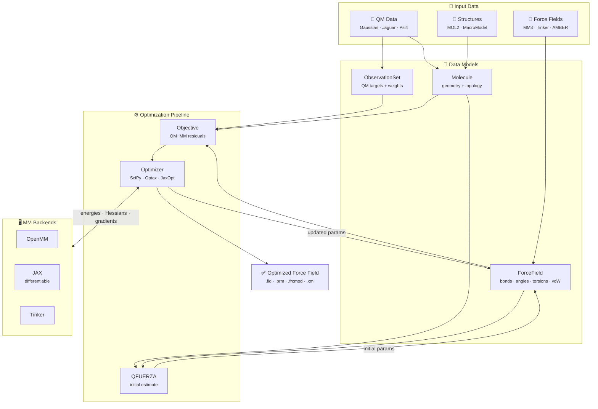

# Q2MM

**Quantum-guided Molecular Mechanics** (Q2MM) is a force field optimization framework
that derives high-quality MM parameters directly from quantum mechanical reference data.
By systematically minimizing the difference between QM-calculated and MM-calculated
molecular properties — energies, geometries, and vibrational frequencies — Q2MM
produces force fields with near-QM accuracy at a fraction of the computational cost.

Use Q2MM when you need accurate force field parameters for molecular
systems where standard parameters don't exist — especially
**transition-state chemistry**, where no off-the-shelf force field
captures the unusual bonding at the reaction's energy barrier.

---

## Why Q2MM?

- **QM accuracy, MM speed** — Parameterize force fields that reproduce QM results
  with near-QM accuracy ([benchmarks](systems/small-molecules.md)) without the QM runtime cost.
- **Hessian-informed starting points** — QFUERZA extracts bond and angle
  force constants from the QM Hessian (the matrix of second derivatives of energy with respect
  to atomic positions), giving the optimizer a physically motivated initial guess.
- **Open-source backends** — First-class support for [OpenMM](https://openmm.org/),
  [JAX](https://jax.readthedocs.io/), [JAX-MD](https://jax-md.readthedocs.io/),
  [Tinker](https://dasher.wustl.edu/tinker/), and [Psi4](https://psicode.org/).
- **Robust optimization** — Leverages [`scipy.optimize`](https://docs.scipy.org/doc/scipy/reference/optimize.html) methods (L-BFGS-B,
  Nelder-Mead, trust-constr, Powell, least-squares) and JAX-native
  [optax](https://optax.readthedocs.io/) adaptive optimizers (Adam, AdaGrad,
  SGD) for force field parameter fitting.
- **Clean model layer** — immutable `ForceField`, `Molecule`, and `ObservationSet`
  objects, plus explicit `ParameterLayout` / `ActiveParameterSpace` helpers,
  decouple algorithms from file formats and optimization state.

---

## Architecture

The diagram below shows how data flows through q2mm — from QM reference
data through the model layer to optimized force field parameters.

```mermaid
flowchart TD
    %% ── Input sources ──
    subgraph Inputs["📂 Input Data"]
        direction LR
        QM["🔬 QM Data<br/><small>Gaussian · Jaguar · Psi4</small>"]
        STRUCT["🧬 Structures<br/><small>MOL2 · MacroModel</small>"]
        FFIN["📄 Force Fields<br/><small>MM3 · Tinker · AMBER</small>"]
    end

    %% ── Models ──
    subgraph Models["🧱 Data Models"]
        direction LR
        MOL["Molecule<br/><small>geometry + topology</small>"]
        RD["ObservationSet<br/><small>QM targets + weights</small>"]
        FF["ForceField<br/><small>bonds · angles · torsions · vdW</small>"]
    end

    %% ── Core pipeline ──
    subgraph Pipeline["⚙️ Optimization Pipeline"]
        direction LR
        QFUERZA["QFUERZA<br/><small>initial estimate</small>"]
        OBJ["Objective<br/><small>QM−MM residuals</small>"]
        OPT["Optimizer<br/><small>SciPy · Optax · JaxOpt</small>"]
    end

    %% ── Backends ──
    subgraph Backends["🖥️ MM Backends"]
        direction LR
        OMM["OpenMM"]
        JX["JAX<br/><small>differentiable</small>"]
        TK["Tinker"]
    end

    %% ── Output ──
    FFOUT["✅ Optimized Force Field<br/><small>.fld · .prm · .frcmod · .xml</small>"]

    %% ── Connections ──
    QM --> RD
    QM --> MOL
    STRUCT --> MOL
    FFIN --> FF

    MOL --> QFUERZA
    FF --> QFUERZA
    QFUERZA -->|"initial params"| FF

    RD --> OBJ
    FF --> OBJ
    MOL --> OBJ
    OBJ --> OPT

    OPT <-->|"energies · Hessians · gradients"| Backends
    OPT -->|"updated params"| FF

    OPT --> FFOUT
```

**Pipeline overview:**

1. **I/O modules** read three kinds of external data into q2mm's unified models:
    - **QM programs** (Gaussian `.log`/`.fchk`, Jaguar `.in`/`.out`, or Psi4 live calculations) → `ObservationSet` (energies, frequencies, geometries, eigenmatrix targets) and `Molecule` (geometry + optional Hessian)
    - **Molecular structures** (XYZ `.xyz`, MOL2 `.mol2`, MacroModel `.mmo`) → `Molecule` (atom coordinates, bond connectivity)
    - **Force field parameters** (MM3 `.fld`, Tinker `.prm`, AMBER `.frcmod`) → immutable `ForceField` values

    Optimized parameters are written back via the same force field modules, plus OpenMM `.xml` export.
2. **QFUERZA estimation** projects the QM Hessian onto internal coordinates to extract
   physically motivated initial bond and angle force constants.
3. **Objective function** computes weighted residuals between QM reference values and
   MM-calculated properties for the current parameter set.
4. **Optimizer** drives `scipy.optimize` or [optax](https://optax.readthedocs.io/)
   to minimize the objective, iterating over parameter updates.
5. **MM backends** (OpenMM, Tinker, or JAX) evaluate energies and gradients at each
   optimization step.

---

## Next steps

New to Q2MM? Start with [Getting Started](getting-started.md) for installation,
then follow the [Tutorial](tutorial.md) for a complete parameterization walkthrough.
