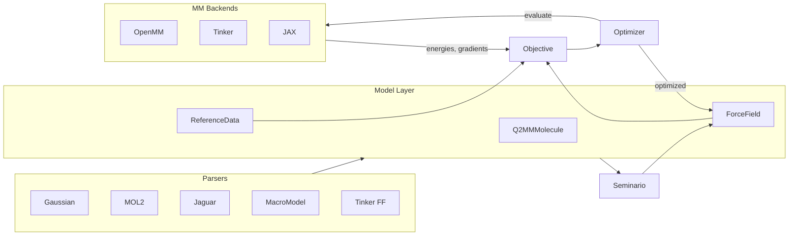

# Q2MM

**Quantum-guided Molecular Mechanics** (Q2MM) is a force field optimization framework
that derives high-quality MM parameters directly from quantum mechanical reference data.
By systematically minimizing the difference between QM-calculated and MM-calculated
molecular properties — energies, geometries, and vibrational frequencies — Q2MM
produces force fields with near-QM accuracy at a fraction of the computational cost.

---

## Why Q2MM?

- **QM accuracy, MM speed** — Parameterize force fields that reproduce QM results
  without the QM runtime cost.
- **Hessian-informed starting points** — The Seminario method extracts bond and angle
  force constants from the QM Hessian, giving the optimizer a physically motivated
  initial guess.
- **Open-source backends** — First-class support for OpenMM, JAX, JAX-MD,
  Tinker, and Psi4.
- **Robust optimization** — Leverages `scipy.optimize` methods (L-BFGS-B, Nelder-Mead,
  trust-constr, Powell, least-squares) instead of custom gradient code.
- **Clean model layer** — `ForceField`, `Q2MMMolecule`, and `ReferenceData` objects
  decouple algorithms from file formats, making it straightforward to add new
  I/O modules or backends.

---

## Architecture

```mermaid
flowchart LR
    subgraph Parsers
        direction TB
        G[Gaussian]
        M[MOL2]
        J[Jaguar]
        MM[MacroModel]
        T[Tinker FF]
    end

    subgraph Models["Model Layer"]
        direction TB
        MOL[Q2MMMolecule]
        FF[ForceField]
        RD[ReferenceData]
    end

    SEM[Seminario]
    OBJ[Objective]
    OPT[Optimizer]

    subgraph Backends["MM Backends"]
        direction TB
        OMM[OpenMM]
        TK[Tinker]
        JX[JAX]
    end

    Parsers --> Models
    Models --> SEM --> FF
    FF --> OBJ
    RD --> OBJ
    OBJ --> OPT
    OPT -->|evaluate| Backends
    Backends -->|energies, gradients| OBJ
    OPT -->|optimized| FF
```

**Pipeline overview:**

1. **Parsers** read QM output files (Gaussian, Jaguar) and structure files (MOL2,
   MacroModel, Tinker) into unified `Q2MMMolecule` and `ReferenceData` objects.
2. **Seminario method** projects the QM Hessian onto internal coordinates to extract
   physically motivated initial bond and angle force constants.
3. **Objective function** computes weighted residuals between QM reference values and
   MM-calculated properties for the current parameter set.
4. **Optimizer** drives `scipy.optimize` to minimize the objective, iterating over
   parameter updates.
5. **MM backends** (OpenMM, Tinker, or JAX) evaluate energies and gradients at each
   optimization step.
