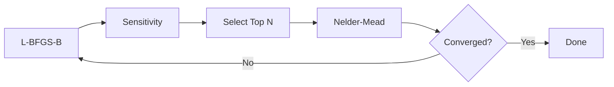
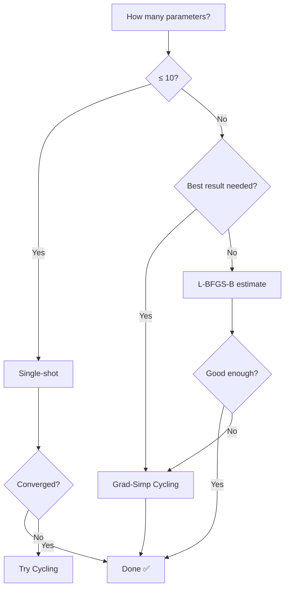

# Optimization Guide

Choosing the right optimization strategy is the single biggest lever you have
over parameter quality and wall-clock time. This page explains the three
strategies Q2MM provides, when to use each, and how they compare.

---

## The Problem: Why One Method Isn't Enough

Force field optimization is a balancing act between **exploration** (searching
the parameter space broadly) and **exploitation** (following gradients to the
nearest minimum). No single optimizer excels at both:

| Challenge | Gradient methods (L-BFGS-B) | Simplex methods (Nelder-Mead) |
|-----------|---------------------------|-------------------------------|
| Speed | ✅ Fast convergence on smooth objectives | ❌ Slow for many parameters |
| Robustness | ❌ Can get stuck in shallow features | ✅ Handles noise and flat regions |
| Scaling | ✅ Cost per step scales as O(N) | ❌ Cost per step scales as O(N²) |
| Derivative-free | ❌ Requires finite-difference gradients | ✅ No gradients needed |

Q2MM solves this by combining both in a **grad-simp cycling
loop**:gradient methods handle the bulk of convergence, then simplex polishes
the parameters that gradients struggle with.

---

## Strategy 1: Single-Shot Optimizer

The simplest approach — run one optimizer on all parameters at once.

```python
from q2mm.optimizers.scipy_opt import ScipyOptimizer

optimizer = ScipyOptimizer(method="L-BFGS-B", maxiter=500, eps=1e-3)
result = optimizer.optimize(objective)
print(result.summary())
```

### When to Use

- **≤ 10 parameters** — small force fields where any method converges quickly
- **Quick iteration** — you want a fast answer, even if not fully converged
- **Seminario-initialized** — when the starting point is already close to optimal

### Available Methods

| Method | Type | Strengths | Weaknesses |
|--------|------|-----------|------------|
| `L-BFGS-B` | Quasi-Newton | Fast, bounded, good default | Finite-difference gradients can miss shallow features |
| `Nelder-Mead` | Simplex | Derivative-free, robust | Slow beyond ~10 params; no bounds support |
| `Powell` | Direction-set | Derivative-free, handles coupling | 2-3× more evaluations than Nelder-Mead |
| `least_squares` | Levenberg-Marquardt | Exploits residual structure | Requires many observations relative to parameters |
| `trust-constr` | Trust-region | Handles constraints | Slower per iteration |

!!! tip "Start with L-BFGS-B"
    For most problems, `L-BFGS-B` with `eps=1e-3` is the best starting
    point. It uses bounded quasi-Newton optimization and converges in
    50-200 iterations for well-behaved objectives. Only switch to
    derivative-free methods if you see convergence issues.

---

## Strategy 2: Grad-Simp Cycling (Recommended for Large Systems)

The flagship optimization strategy, based on the approach described in
Norrby & Liljefors ([*J. Comput. Chem.* **1998**, 19, 1146](https://doi.org/10.1002/(SICI)1096-987X(19980730)19:10%3C1146::AID-JCC4%3E3.0.CO;2-M)). Each cycle:

1. **Full-space gradient pass** — L-BFGS-B on all N parameters
2. **Sensitivity analysis** — rank every parameter by how much the objective
   responds to perturbation
3. **Subspace simplex** — Nelder-Mead on only the top 3 most sensitive
   parameters
4. **Convergence check** — stop when improvement drops below threshold

```python
from q2mm.optimizers.cycling import OptimizationLoop

loop = OptimizationLoop(
    objective,
    max_params=3,         # simplex on top 3 params per cycle
    max_cycles=10,        # up to 10 grad-simp cycles
    convergence=0.01,     # stop when <1% improvement per cycle
    full_method="L-BFGS-B",
    simp_method="Nelder-Mead",
    full_maxiter=200,
    simp_maxiter=200,
    verbose=True,
)

result = loop.run()
print(result.summary())
```

### When to Use

- **10–100+ parameters** — the sweet spot where single-shot simplex fails but
  gradients alone leave residual error
- **Production optimizations** — when you need the best possible parameters
- **Transition state force fields** — complex coupling between parameter types
- **Stubborn parameters** — when L-BFGS-B converges but leaves a non-trivial
  residual

### How Sensitivity Selection Works

The key innovation is **derivative-based parameter selection**. Before each
simplex pass, Q2MM perturbs every parameter by its type-specific step size
and computes:

- **d1** — first derivative (how steeply the objective changes)
- **d2** — second derivative (curvature / how quickly the slope changes)
- **simp_var = d2 / d1²** — the selection metric

Parameters with **low simp_var** have high sensitivity relative to curvature.
These are exactly the parameters where simplex excels: the objective responds
strongly to changes (high d1) but the landscape is flat-bottomed (low d2),
making gradient methods inefficient.



!!! info "Why only 3 parameters?"
    The Nelder-Mead simplex creates N+1 vertices in N dimensions. With 3
    parameters, the simplex has 4 vertices — each requiring one objective
    evaluation per reflection/expansion/contraction step. With 20
    parameters, you'd need 21 vertices and convergence slows dramatically.
    Quinn et al. (2022) confirmed that "the modified simplex method has
    shown to have faster convergence than Raphson-type methods up to ca.
    40 parameters," but the default is just 3 per cycle.

### Understanding the Output

```python
result = loop.run()

# Per-cycle objective scores (including initial)
print(result.cycle_scores)
# [42.9, 12.3, 4.1, 1.8, 1.7]

# Which parameters were selected for simplex each cycle
for i, indices in enumerate(result.selected_indices):
    labels = objective.forcefield.get_param_type_labels()
    selected = [labels[j] for j in indices]
    print(f"Cycle {i+1}: {selected}")
# Cycle 1: ['bond_k', 'angle_eq', 'bond_eq']
# Cycle 2: ['angle_k', 'bond_k', 'vdw_epsilon']

# Sensitivity details
for sens in result.sensitivity_results:
    print(f"d1: {sens.d1}")
    print(f"simp_var: {sens.simp_var}")
```

### Configuration Reference

| Parameter | Default | Description |
|-----------|---------|-------------|
| `max_params` | `3` | Parameters per simplex pass. Increase to 4–5 for larger systems. |
| `max_cycles` | `10` | Maximum grad-simp iterations. Most problems converge in 3–5 cycles. |
| `convergence` | `0.01` | Stop when fractional improvement < this value (1% default). |
| `full_method` | `"L-BFGS-B"` | Scipy method for the full-space pass. |
| `simp_method` | `"Nelder-Mead"` | Scipy method for the subspace pass. |
| `full_maxiter` | `200` | Iteration budget for the gradient pass. |
| `simp_maxiter` | `200` | Iteration budget for the simplex pass. |
| `sensitivity_metric` | `"simp_var"` | `"simp_var"` (d2/d1², default) or `"abs_d1"` (rank by absolute gradient). |
| `eps` | `1e-3` | Finite-difference step for the full-space optimizer. |

---

## Strategy 3: Manual Subspace Optimization

For advanced users who want direct control over which parameters to optimise.
`SubspaceObjective` wraps your full objective and only exposes a subset of
parameters, holding the rest fixed.

```python
from q2mm.optimizers.cycling import SubspaceObjective
from q2mm.optimizers.scipy_opt import ScipyOptimizer

# Only optimise bond force constants (indices 0 and 2)
full_vec = ff.get_param_vector()
sub_obj = SubspaceObjective(objective, [0, 2], full_vec)

# Use any scipy method on the small subspace
import scipy.optimize
result = scipy.optimize.minimize(
    sub_obj,
    sub_obj.get_initial_vector(),
    method="Nelder-Mead",
    options={"maxiter": 500},
)

# Apply optimised subspace back to the full force field
best_full = sub_obj.build_full_vector(result.x)
ff.set_param_vector(best_full)
```

### When to Use

- **Expert parameter tuning** — you know exactly which parameters need attention
- **Debugging** — isolate whether a specific parameter type is causing issues
- **Custom cycling strategies** — build your own outer loop with domain knowledge

### Useful ForceField Helpers

```python
# Get indices grouped by parameter type
indices = ff.get_param_indices_by_type()
# {'bond_k': [0, 2], 'bond_eq': [1, 3], 'angle_k': [4], ...}

# Get human-readable labels for each position in the param vector
labels = ff.get_param_type_labels()
# ['bond_k', 'bond_eq', 'bond_k', 'bond_eq', 'angle_k', 'angle_eq', ...]

# Get per-type finite difference step sizes
steps = ff.get_step_sizes()
# array([0.1, 0.02, 0.1, 0.02, 0.1, 1.0, ...])
```

---

## Standalone Sensitivity Analysis

You can run sensitivity analysis independently, without the full
grad-simp loop. This is useful for diagnosing which parameters matter most
in your problem.

```python
from q2mm.optimizers.cycling import compute_sensitivity

sens = compute_sensitivity(objective, metric="simp_var")

# Rank parameters from most to least suitable for simplex
labels = ff.get_param_type_labels()
for rank, idx in enumerate(sens.ranking):
    print(f"  {rank+1}. {labels[idx]:12s}  d1={sens.d1[idx]:+.4f}  "
          f"d2={sens.d2[idx]:.4f}  simp_var={sens.simp_var[idx]:.4f}")
```

Expected output:

```
  1. bond_k        d1=+0.3421  d2=0.0012  simp_var=0.0102
  2. angle_eq      d1=-0.1893  d2=0.0089  simp_var=0.2483
  3. bond_eq       d1=+0.0542  d2=0.0031  simp_var=1.0541
  4. angle_k       d1=-0.0103  d2=0.0002  simp_var=1.8856
```

!!! note "Cost"
    Sensitivity analysis requires **2N + 1** objective evaluations (one
    baseline plus two perturbations per parameter). For a 20-parameter
    force field with OpenMM, this takes about 0.2 seconds.

---

## Choosing a Strategy: Decision Flowchart



### Quick Reference

| Scenario | Strategy | Expected Time (OpenMM) |
|----------|----------|----------------------|
| Small FF (≤ 10 params), quick iteration | `ScipyOptimizer("L-BFGS-B")` | 1–10 s |
| Small FF, derivative-free | `ScipyOptimizer("Nelder-Mead")` | 2–30 s |
| Medium FF (10–40 params), production | `OptimizationLoop(max_params=3)` | 30 s – 5 min |
| Large FF (40–100 params), production | `OptimizationLoop(max_params=4)` | 2–15 min |
| Expert: tune specific params | `SubspaceObjective` + manual | varies |
| Diagnostics: which params matter? | `compute_sensitivity()` | < 1 s |

---

## Tips and Pitfalls

!!! warning "L-BFGS-B may not fully converge"
    With finite-difference gradients (`eps=1e-3`), L-BFGS-B can miss
    shallow features in the objective landscape. On the water test case (4
    params), L-BFGS-B converges to a score of 0.93 while Nelder-Mead
    reaches 0.000. This is exactly why the grad-simp loop exists — the
    simplex pass cleans up what the gradient pass leaves behind.

    For engines that support analytical gradients (JAX, JAX-MD, OpenMM),
    setting `jac="auto"` on `ScipyOptimizer` enables analytical gradients
    via `energy_and_param_grad()` for energy-based evaluators, which
    should improve L-BFGS-B convergence.

!!! tip "Seminario initialization matters"
    Starting from Seminario-estimated parameters (extracted from the QM
    Hessian) puts you much closer to the optimum. The optimizer then needs
    fewer evaluations to converge. Always use
    `estimate_force_constants()` before optimization when QM data is
    available.

!!! tip "Monitor convergence"
    Plot `result.history` (for single-shot) or `result.cycle_scores`
    (for cycling) to visualize convergence. If the score plateaus early,
    the optimizer may be stuck — try increasing `max_params` or switching
    the sensitivity metric to `"abs_d1"`.

!!! info "OpenMM is ~150× faster than Tinker"
    OpenMM evaluates energies in-process (~5 ms/eval vs ~160 ms/eval for
    Tinker). For optimization runs that require hundreds or thousands of
    evaluations, this difference is dramatic. Use OpenMM when available.
    See the [Benchmarks](benchmarks/index.md) page for detailed benchmarks.

---

## Further Reading

- [Tutorial: Step 6 — Optimize](tutorial.md#step-6-optimise-the-force-field) — full walkthrough of a single-shot optimization
- [API: ScipyOptimizer](api.md#scipyoptimizer) — constructor parameters and method table
- [Benchmarks](benchmarks/index.md) — benchmark data for all backends and methods
- [References](references.md) — academic papers describing the Q2MM methodology
